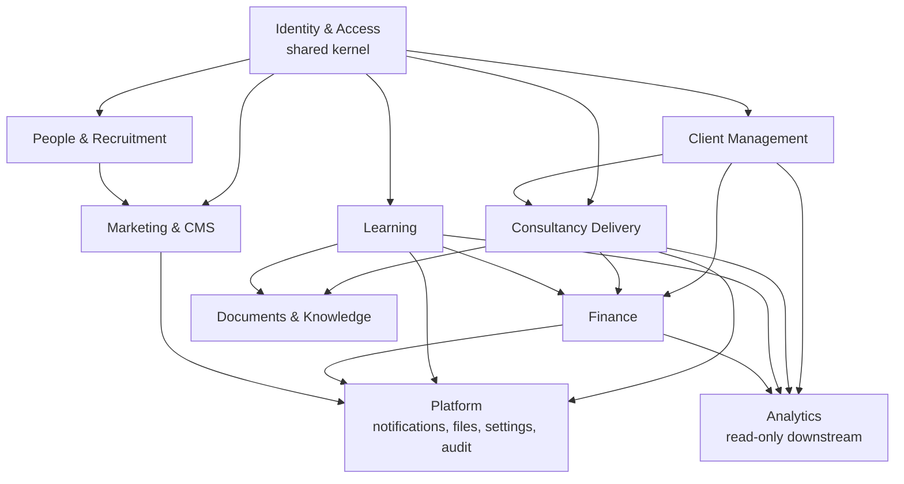

# Document 03 — Domain Model & System Architecture Foundation

**Project:** CKBHSE Enterprise Digital Platform
**Document:** 03 — Architecture Review
**Version:** 1.0
**Prepared by:** Engineering, acting as Principal Architect
**Reviewed against:** Document 01 (Product Vision), Document 02 (Business Requirements Specification)
**Scope:** Architectural analysis and recommendations only. No features built, no files moved, no schema created.
**Repository state at time of review:** commit `be9c03c`, working tree clean, `pnpm run verify` green.

---

# Executive Summary

The platform is in an unusually good position for its age. Phases 0 and 1 produced something most projects of this size lack: a workspace that builds reproducibly on two operating systems, a contract-first API pipeline where the OpenAPI document generates both the typed client and its runtime validators, a hardened HTTP edge, versioned migrations, and a single shared design system. Continuous integration enforces all of it, including a drift check that fails if generated code and specification disagree. That is a real foundation, not a scaffold.

It is also, measured against Document 02, approximately **8% of the required product**. Five of the six ecosystems in BRS §4 do not exist, and neither does authentication. This review is therefore not about improving what is built; it is about whether the shape of what is built can absorb what is coming without a rewrite. My conclusion is that it can, with **four structural changes made before the first authenticated feature lands**, and one decision that belongs to you.

### The four structural changes

1. **Introduce a data-access boundary before any table exists.** `lib/db` currently exports a live `db` handle and re-exports the entire schema, so any module in the platform can query any table. BRS §10 requires that "every client has isolated access to their own data only." A rule enforced by convention in route handlers will be violated — not through malice, but on an ordinary Tuesday, by a correct-looking query that forgot one `where` clause. Organisation scoping has to live somewhere it cannot be forgotten.
2. **Design the audit log and the permission model now, not when Admin is built.** BRS §10 mandates an immutable audit trail for all sensitive actions, and BRS §7 defines eleven roles. Both are cross-cutting concerns. Retrofitting either across thirty domains costs several times what building them first costs.
3. **Decide the file storage story before Documents, Certificates, or LMS video.** Four separate BRS domains hinge on binary content. The platform currently has nowhere to put a file, and the deployment target is autoscale, where local disk is ephemeral and per-instance.
4. **Split the API surface into versioned domain modules.** One `openapi.yaml` and one flat Express router are correct for two health endpoints and untenable for thirty domains.

### The decision that belongs to you

This brief is written for Next.js — it asks about Server Actions, Route Handlers, `src/app/`, server components, and Prisma models. **The codebase uses none of them.** It is a Vite SPA with an Express API and Drizzle, which is what decisions #1 and #2 in `replit.md` recorded, amending Document 01. Document 03's brief now assumes the un-amended stack, which means the divergence is compounding rather than settling.

I have written this review against the code that exists, and reinterpreted the Next.js-specific questions honestly rather than answering them as though the framework were already in place. §"API Strategy" and §"Performance Review" say explicitly where a question does not apply and what the equivalent concern is.

The reason this is a decision rather than a problem is that it is **narrower than it looks**. Only the public marketing site needs SEO; the five authenticated ecosystems have no such requirement, and an SPA is a perfectly good — arguably better — choice for them. And because six front ends must share one set of business rules, **Server Actions are the wrong home for business logic under any framework**, since logic invoked from a Next.js app is unreachable from the LMS or the client portal. So the framework question reduces to _how the marketing site renders_, and leaves the API strategy untouched. That makes it scoped and reversible, and it is why I have not pre-empted it. My recommendation is option B in §"The framework question, restated" — Next.js for the public site only — and the design-system extraction just completed is what makes that migration cheap.

### What I am not worried about

Scale, in the conventional sense. Ten thousand organisations and a hundred thousand users is a small workload for PostgreSQL; the review identifies bottlenecks, but almost none of them are row counts. The genuine limits are connection pooling under autoscale, binary content delivery, notification fan-out, and analytics queries competing with transactional load. Each has a well-understood answer that does not require a distributed system.

---

# Current Architecture

## What exists

Nine workspace packages under pnpm, with TypeScript project references wiring them together:

| Package                    | Role                                                                     | State                                                        |
| -------------------------- | ------------------------------------------------------------------------ | ------------------------------------------------------------ |
| `artifacts/ckbhse-website` | Public marketing SPA — Vite 7, React 19, wouter, Tailwind v4             | 11 routes, 8 substantive pages, all content hardcoded        |
| `artifacts/api-server`     | Express 5 API                                                            | Hardened edge; two endpoints (`/api/healthz`, `/api/readyz`) |
| `artifacts/mockup-sandbox` | Component preview harness                                                | Functional but **contains zero mockups**                     |
| `lib/ui`                   | Shared design system — 55 shadcn primitives, hooks, `cn`, structural CSS | Complete, sole copy                                          |
| `lib/api-spec`             | `openapi.yaml` plus Orval configuration                                  | Source of truth for contracts                                |
| `lib/api-client-react`     | Generated React Query hooks and `customFetch`                            | Generated; drift-checked in CI                               |
| `lib/api-zod`              | Generated Zod validators                                                 | Generated; drift-checked in CI                               |
| `lib/db`                   | Drizzle client and migration runner                                      | Wired; **schema directory is empty**                         |
| `scripts`                  | Workspace tooling                                                        | Minimal                                                      |

## Strengths

**The contract-first pipeline is the single most valuable asset in the repository.** `lib/api-spec/openapi.yaml` generates both the typed React Query client and the Zod validators, and CI regenerates and fails on any difference. This means the API contract cannot silently drift from either the server that implements it or the clients that consume it. Most teams reach for this after their third integration bug; it is already here, before the first real endpoint. With six front ends coming, its value multiplies rather than stays flat.

**Module boundaries are real, not aspirational.** The `lib/*` packages are separate compilation units with explicit `exports` maps and TypeScript project references. A boundary enforced by the compiler is a boundary that survives deadline pressure, unlike one enforced by a folder name and good intentions.

**The HTTP edge is genuinely production-grade.** Helmet with a deliberately restrictive JSON-only CSP, an explicit CORS allowlist with credentials enabled, two rate limiters with the stricter one reserved for credential endpoints, request body limits, compression, environment variables validated through a Zod schema at boot, a normalised error envelope carrying a correlatable `requestId`, separated liveness and readiness probes, and graceful shutdown that drains before exit. This is the layer teams habitually postpone and then bolt on after an incident.

**The design system is centralised with colour deliberately left to each application.** `lib/ui` owns structure; each app owns its palette. This is exactly the arrangement four more front ends require, and it was verified by bundle comparison rather than assumed.

**Quality gates exist and pass.** Zero lint errors across the workspace, a clean typecheck over ten projects, nine API tests, and a CI pipeline running format, lint, typecheck, test, build, and codegen drift.

**Migrations are versioned, and `generate` works without a database.** CI can verify migration consistency without provisioning PostgreSQL. `push` survives but is documented as throwaway-only, because it mutates a database leaving no history and cannot satisfy the BRS audit and rollback rules.

## Weaknesses

These are ordered by how expensive they become if left alone.

**`lib/db` has no boundary, and a module-level side effect.** Two distinct problems in fourteen lines. First, `export * from './schema'` combined with an exported `db` handle means every consumer can reach every table — the exact opposite of what BRS §10's isolation rule needs. Second, the file throws at _import_ time when `DATABASE_URL` is absent, which makes merely importing the package fatal in any context without a database: unit tests, code generation, static analysis. A lazily-initialised accessor removes the second problem; a repository layer removes the first.

**TypeScript is not actually strict.** `tsconfig.base.json` enables flags individually rather than setting `strict: true`, and the gaps matter: `strictFunctionTypes` is explicitly `false`, `noUnusedLocals` is `false`, `noImplicitOverride` is `false`, and `noUncheckedIndexedAccess` and `exactOptionalPropertyTypes` are absent entirely. `noUncheckedIndexedAccess` is the significant one — without it, array and record access is typed as though it always succeeds, which is precisely the assumption that produces runtime `undefined` in code handling invoices and certificates. Turning these on later, across thirty domains, is a large mechanical change; turning them on now costs almost nothing.

**The error envelope is declared but not attached to any operation.** `ErrorResponse` exists in `openapi.yaml` under `components.schemas` and Orval does emit it as a type, but no operation's `responses` block references it. Consequently the generated hooks do not type their error channel, and every client will hand-roll error narrowing against a contract that is already published. Adding a `default` response referencing `ErrorResponse` to each operation fixes this at the source.

**`customFetch` never sets `credentials`, and still carries a bearer-token path.** The default is `same-origin`, which works today only because the Vite dev server proxies `/api` onto one origin. The moment a portal is served from a different origin than the API, session cookies will silently stop being sent — and it will present as "login does nothing." Separately, `setAuthTokenGetter` attaches `Authorization: Bearer`, which contradicts the recorded session-cookie decision. Its own doc comment says it should never be used on the web, which is a comment doing a type system's job.

**Two names for one concept in `api-server/src`.** Both `middleware/` (holding the real `error.ts` and `security.ts`) and an empty scaffold `middlewares/` exist. Trivial today; the beginning of "which directory does this go in?" tomorrow.

**The API router is flat and unversioned.** `routes/index.ts` mounts one health router directly under `/api`. There is no version segment and no module grouping, so the first twenty endpoints will land in a directory that has no organising principle.

**Front-end structure is page-centric, with no feature boundaries.** All eleven routes are eagerly imported in `App.tsx`, and shared components sit in a flat `components/` directory. This is correct for a marketing site and will not survive a client portal, where a single feature spans pages, hooks, forms, and API calls.

**`QueryClient` is constructed with no configuration.** No `staleTime`, no retry policy, no global error handling. Defaults are reasonable for eight static pages; across five data-driven front ends, caching behaviour should be a deliberate, shared decision rather than an accident of per-hook defaults.

**Environment documentation has drifted from the schema it documents.** `.env.example` omits every variable added during Phase 1 — `NODE_ENV`, `CORS_ORIGINS`, `TRUST_PROXY`, `RATE_LIMIT_WINDOW_MS`, `RATE_LIMIT_MAX`, `BODY_LIMIT`, `SHUTDOWN_TIMEOUT_MS` — and still states that the Vite port defaults to 5173 when it is now 5180. A misleading example file is worse than none, because it is trusted.

**Deployment configuration does not describe the system that now exists.** `.replit` declares an autoscale target with a `postBuild` step and nothing else: no build command, no run command, no port mapping. The repository now produces two static bundles and one long-running server. How those three artifacts are served in production is undefined.

**`mockup-sandbox` is an empty artifact,** and `scripts/post-merge.sh` is a bash hook that cannot execute on the primary development platform.

## Risks

**Data isolation enforced in handlers will eventually leak.** This is the highest-severity architectural risk in the platform, because the failure mode is a client seeing another client's audit report, and the blast radius is regulatory rather than technical. Handler-level scoping is one forgotten predicate away from a breach, and the forgotten predicate is invisible in review — the query looks fine.

**A retrofitted audit log is never complete.** BRS §10 requires immutability across all sensitive actions. If auditing is added after the domains, coverage is determined by whoever remembered, and the gaps are unknowable without an exhaustive re-review.

**Content versioning cannot be added after the fact.** BRS §10 requires public content changes to be versioned and rollable-back. History that was never recorded cannot be recovered, so this must be designed into the CMS domains from their first migration.

**Binary content has no home, and the deployment target makes the naive answer wrong.** Audit reports, certificates, uploaded evidence, and LMS video are all core. On autoscale, local disk is ephemeral and per-instance, so anything written to it disappears or is invisible to the next request. Storing files in PostgreSQL solves durability by trading it for a bloated database, slow backups, and no CDN path.

**Connection exhaustion arrives long before row-count problems.** Autoscale multiplies instances; each instance holds a pool. The default `pg` pool of ten connections across twenty instances is two hundred connections against a PostgreSQL server that typically permits one hundred. This bites at moderate traffic, presents as intermittent timeouts, and is unrelated to how much data exists.

**Analytics on the transactional database will degrade the product.** BRS §3 and §8 require reporting and analytics. Dashboard aggregations over invoices and enrolments will compete with the requests users are waiting on.

**The SEO obligation currently rests on unwritten code.** Keeping the SPA means BRS §9's SEO requirement is met by prerendering and per-route metadata that do not yet exist. Every route added before that work lands increases its cost.

## Recommendations

Detailed and sequenced in §"Refactoring Recommendations". In summary: introduce repositories and a lazy database accessor; tighten TypeScript; design the permission model, audit log, and file storage as first-class concerns before the domains that need them; version and modularise the API; adopt feature-first front-end structure at the first portal; and settle the framework question now while the public site is eight pages.

## The framework question, restated

Because this recurs in every document, it deserves a decision rather than another amendment.

**What Document 01 and this brief specify:** Next.js App Router, Prisma, Server Actions, Route Handlers, server components.
**What exists:** Vite SPA, Express, Drizzle, OpenAPI-generated REST client.
**What was decided:** keep Vite and Drizzle (`replit.md`, decisions #1 and #2), meeting SEO through prerendering and per-route metadata.

The three viable paths:

**A — Hold the line.** Vite SPAs throughout; prerender the marketing site. Cheapest immediately. SEO becomes bespoke infrastructure we own and maintain, and Documents 01 and 03 need formal amendment to stop specifying a framework we are not using.

**B — Split by requirement (recommended).** Next.js for the public marketing site only, because that is the sole ecosystem with an SEO requirement, and Next.js discharges it by default rather than by bespoke tooling. Vite SPAs for the five authenticated ecosystems, where SEO is irrelevant. Express remains the single API for all six. Cost is one migration of eight pages, and it is at its cheapest right now — the `lib/ui` extraction just completed means the primitives and Tailwind layer port as a dependency rather than a copy. The price is a second toolchain in the monorepo.

**C — All-in Next.js.** One framework everywhere. Server Actions become available, but the hardened Express edge, the Orval contract chain, and much of Phase 1 lose their purpose, and either one Next application serves five very different ecosystems or five Next applications multiply the operational surface.

**Why this is lower-stakes than it appears.** With six front ends, business logic cannot live in Server Actions regardless of framework, because a Server Action in a Next.js marketing app is unreachable from the LMS or the client portal. The shared, versioned, typed API is required under every option. So this decision governs _how the marketing site renders_ and nothing else — it does not touch the domain model, the API strategy, the database design, or the security architecture set out in the rest of this document. That is why the recommendation is safe to defer to you, and safe to reverse.

---

# Domain Model

Thirty-two domains, grouped by the bounded context that owns them. Each entry states purpose, responsibilities, and the scalability consideration that should shape its design from the first migration.

## Identity & Access

### Identity

**Purpose.** Authenticate a human and prove who they are on every subsequent request.
**Responsibilities.** Credential storage and verification, session lifecycle, multi-factor enrolment and challenge, password reset, email verification, lockout after repeated failure, impersonation for support with an audit trail.
**Scalability.** Sessions must be shared state, not per-instance memory, because autoscale runs many instances. Password hashing is deliberately expensive, so credential endpoints need their own rate budget — `authRateLimiter` already exists for this and is currently unmounted. Keep identity separable from profile: attaching an external provider later should not require touching user records.

### Users

**Purpose.** The person, distinct from their credentials and from their roles.
**Responsibilities.** Profile, contact details, locale and notification preferences, employment or membership linkage, activation state.
**Scalability.** A user may be a client contact, a student, and a staff member simultaneously; BRS §6 lists these as separate roles but they are not separate people. Model one user with many role assignments rather than parallel user tables, or every cross-domain query becomes a union.

### Roles & Permissions

**Purpose.** Express the eleven access levels of BRS §6 and the capability lists of BRS §7 in a form code can evaluate.
**Responsibilities.** A catalogue of fine-grained permissions, roles as named permission bundles, assignment of roles to users within a scope, and the Super Admin approval that BRS §10 requires before a user may hold multiple roles.
**Scalability.** Permissions are additive over the platform's life; roles are relatively stable. Keep the permission catalogue in migrations so it is versioned and reviewable, and never branch on a role name in application code — see §"Authentication Review".

### Organizations

**Purpose.** The tenant. The unit that BRS §10's isolation rule protects.
**Responsibilities.** Company identity, registration and trading details, addresses and sites, contract and retainer status, membership of users, subscription entitlements.
**Scalability.** This is the partition key for the entire platform. Every tenant-scoped table carries `organization_id`, and every index on those tables leads with it. Ten thousand organisations is small; what matters is that the scoping predicate is unforgettable rather than conventional.

### Sessions

**Purpose.** Bind a request to an authenticated identity.
**Responsibilities.** Issue, renew, and revoke; record device and IP for the security log; support "sign out everywhere"; enforce absolute and idle expiry.
**Scalability.** Server-side sessions in PostgreSQL are correct at this scale and give instant revocation, which stateless JWTs cannot. Revocation matters more than the marginal read: a dismissed consultant must lose access immediately.

### Audit Log

**Purpose.** Satisfy BRS §10's immutable record of all sensitive actions.
**Responsibilities.** Capture actor, action, target entity, before and after state, request correlation ID, IP, user agent, timestamp — append-only, with no update or delete path.
**Scalability.** The highest-growth table in the platform, and write-heavy. Design for time-based partitioning and a retention policy from the start, and never join it into transactional queries. The `requestId` already present in the error envelope should be the correlation key.

## Client Management

### Clients

**Purpose.** The commercial relationship with an organisation, as distinct from the organisation record itself.
**Responsibilities.** Account ownership, service history, retainer terms, health and satisfaction signals, primary contacts.
**Scalability.** Resist merging this into Organizations. An organisation is an identity boundary; a client is a commercial one. They diverge as soon as a partner or a prospect exists that is not a paying client.

### Contacts

**Purpose.** People at a client organisation who may or may not have platform logins.
**Responsibilities.** Role at the organisation, communication preferences, consent records, optional linkage to a User.
**Scalability.** Most contacts never log in. Requiring a User row for each would pollute identity and distort every user-count metric.

### Contact Requests

**Purpose.** Inbound enquiries from BRS §8's contact forms.
**Responsibilities.** Capture, deduplicate, assign, track to resolution, convert to a client or a booking, retain provenance for marketing attribution.
**Scalability.** Publicly writable and therefore abuse-exposed: needs the rate limiter, spam scoring, and a hard size cap. **This is the platform's first persistence requirement** — the form currently discards every submission.

### Bookings

**Purpose.** Consultation scheduling from BRS §4 and §8.
**Responsibilities.** Advertise availability, hold and confirm slots, reschedule and cancel, send reminders, link a booking to the project it produces.
**Scalability.** Concurrent booking of one slot is a genuine race requiring a database-level constraint rather than an application check. Time zones and UK daylight saving must be handled in storage, not presentation.

## Consultancy Delivery

### Consultancy Projects

**Purpose.** The engagement — the spine of BRS §3's consultancy objectives.
**Responsibilities.** Scope, the unique reference number BRS §10 mandates, lifecycle state, assigned consultants, milestones, deliverables, client visibility rules.
**Scalability.** Reference numbers must be collision-free under concurrency, which means a database sequence rather than a counted query. Expect projects to accumulate indefinitely and to need archival separate from deletion.

### Assignments

**Purpose.** Which consultant is responsible for what, per BRS §7's Operations Manager capability.
**Responsibilities.** Allocation, scheduling, workload and capacity, handover.
**Scalability.** This is the authorisation input for "manage assigned clients" — a consultant's data visibility derives from their assignments, so it is read on nearly every consultancy request and must be cheap to evaluate.

### Audits

**Purpose.** Compliance audits and their findings.
**Responsibilities.** Scheduling, checklists, evidence capture, findings with severity, recommendations, secure report delivery, sign-off.
**Scalability.** Evidence is binary and can be large. Findings generate corrective actions, so model the relationship rather than embedding a list. Audit templates need versioning: a report must render as it was issued, not as the current template would render it.

### Risk Assessments

**Purpose.** BRS §4's Risk Assessment Builder, reserved for a later phase but shaped now.
**Responsibilities.** Hazard identification, likelihood and severity scoring, control measures, residual risk, review cycles, approval.
**Scalability.** Inherently a versioned document with an approval workflow. Designing it as a mutable record will make the "what did we assess in March" question unanswerable.

### Incidents

**Purpose.** Incident and near-miss reporting.
**Responsibilities.** Capture, classification, investigation, root cause, corrective action, regulatory reporting thresholds, trend analysis.
**Scalability.** Reporting is often mobile and offline-tolerant, which argues for idempotent submission via client-supplied keys.

### Corrective Actions

**Purpose.** The follow-up work that audits, incidents, and assessments generate.
**Responsibilities.** Ownership, due dates, escalation, verification of closure.
**Scalability.** A single cross-domain worklist shared by three source domains. Model it once with a polymorphic source rather than three near-identical tables, and drive notifications from due dates.

### Inspections

**Purpose.** BRS §4's future Inspection App.
**Responsibilities.** Templates, scheduled and ad-hoc rounds, photographic evidence, offline capture and later synchronisation.
**Scalability.** Offline-first synchronisation is a substantially different contract from request-response. Do not design it until the phase arrives, but do not preclude it either — idempotent writes keep the door open.

## Learning Management

### Courses

**Purpose.** The accredited catalogue of BRS §3.
**Responsibilities.** Metadata, accreditation and expiry, pricing, prerequisites, publication state, instructor assignment, versioning.
**Scalability.** Course content changes while learners are mid-course. Enrolments must pin to a course _version_, or a learner's progress silently refers to lessons that no longer exist.

### Modules & Lessons

**Purpose.** Course structure and delivery.
**Responsibilities.** Ordering, content blocks, video references, downloadable materials, completion criteria.
**Scalability.** Video must never be served through the API. Store references, deliver via CDN with signed, expiring URLs.

### Enrollments

**Purpose.** A learner's participation in a course.
**Responsibilities.** Registration, payment gate per BRS §10, access window, seat allocation for organisation-purchased blocks, cancellation and transfer.
**Scalability.** The join point between Finance and Learning, and where BRS §10's "payments confirmed before unlock" rule is enforced. It must be enforced server-side at content access time, not only at enrolment time.

### Progress

**Purpose.** Track lesson-level completion for BRS §8's progress tracking.
**Responsibilities.** Position, completion, time-on-task, resumption.
**Scalability.** The highest-frequency write in the LMS — potentially every few seconds of video playback. This is the one place where write volume genuinely warrants batching, throttling, or a separate storage decision.

### Assessments

**Purpose.** Quizzes and assignments.
**Responsibilities.** Question banks, attempt limits, timing, automatic and manual marking, pass thresholds, feedback.
**Scalability.** Question banks are sensitive: correct answers must never reach the client for an in-progress attempt, which is an API shaping decision, not a UI one. Attempts are immutable once submitted.

### Certificates

**Purpose.** Issued credentials per BRS §3 and §10.
**Responsibilities.** Eligibility on passing criteria, generation, unique verifiable identifier, expiry and renewal, public verification, revocation.
**Scalability.** A certificate is a legal artifact and must be immutable and independently verifiable. Generate the PDF asynchronously and store it; never regenerate on demand from current data, or a certificate's contents change when the course does.

## Documents & Knowledge

### Documents

**Purpose.** Secure exchange between clients and consultants per BRS §4.
**Responsibilities.** Upload, storage, versioning, access control, retention, download audit, virus scanning.
**Scalability.** Requires object storage with signed URLs. Every download is an auditable event under BRS §10, which means the access grant is issued by the API even when bytes are served by the CDN.

### Resources

**Purpose.** Downloadable compliance material per BRS §3, some free and some paid.
**Responsibilities.** Catalogue, categorisation, entitlement checks, download metering.
**Scalability.** The same file may be public, gated, or paid. Keep entitlement separate from the file record so the rule can change without moving bytes.

### Knowledge Base

**Purpose.** Guidance and policy content.
**Responsibilities.** Authoring, categorisation, search, versioning, review cycles.
**Scalability.** Search is the requirement that grows. PostgreSQL full-text search is sufficient for a long time; the design constraint is to keep the search interface narrow enough that it can be swapped later.

## Finance

### Invoices

**Purpose.** Billing per BRS §7's Finance role.
**Responsibilities.** Generation from projects and enrolments, line items, VAT, sequential numbering, issuance, dunning, credit notes.
**Scalability.** Invoice numbering is legally sequential and gap-free, which is a database sequence concern. Issued invoices are immutable — corrections are credit notes, never edits.

### Payments

**Purpose.** Money received.
**Responsibilities.** Provider integration, authorisation and capture, reconciliation, refunds, failure handling.
**Scalability.** Never trust the client for payment state; the provider's webhook is the source of truth. Webhooks arrive out of order, more than once, and sometimes before your own transaction commits, so idempotency and an inbox pattern are mandatory rather than defensive. Card data must never touch the platform.

### Subscriptions

**Purpose.** The recurring revenue of BRS §2.
**Responsibilities.** Plans, entitlements, billing cycles, upgrades and proration, dunning, cancellation.
**Scalability.** Entitlement is read on nearly every authorised request, so it must be cheap — cache it on the session or the organisation rather than recomputing from billing history.

## People & Recruitment

### Staff

**Purpose.** Internal personnel per BRS §5's HR responsibilities.
**Responsibilities.** Records, competencies and certifications with expiry, availability, onboarding.
**Scalability.** Consultant competency expiry drives assignment eligibility, so it is an authorisation input, not merely an HR record.

### Vacancies

**Purpose.** BRS §8's careers listings.
**Responsibilities.** Publication, structured requirements, closing dates, SEO exposure.
**Scalability.** Public, indexable content — one of the few places where the marketing site's SEO requirement meets dynamic data, which makes it a useful early test of whichever rendering strategy is chosen.

### Job Applications

**Purpose.** Applicant submissions and status tracking per BRS §5.
**Responsibilities.** Application capture, CV upload, stage tracking, communication, GDPR retention limits.
**Scalability.** Publicly writable with file upload — the highest-risk unauthenticated write surface in the platform. Also subject to mandatory deletion after a retention period, which is a scheduled job, not a manual task.

## Marketing & CMS

### Blog & Articles

**Purpose.** BRS §3's content marketing.
**Responsibilities.** Authoring, scheduling, categories, SEO metadata, related content, versioning per BRS §10.
**Scalability.** Public and cacheable. Publication should invalidate a cache, not require a deployment.

### Case Studies, Testimonials

**Purpose.** Social proof per BRS §4 and §8.
**Responsibilities.** Structured records, client approval before publication, outcome metrics, service linkage.
**Scalability.** Client approval is a legal gate, so publication state must be explicit and auditable rather than implied by presence.

### Pages & Navigation

**Purpose.** The editable structure of the public site.
**Responsibilities.** Content blocks, menus, redirects, versioning and rollback per BRS §10.
**Scalability.** This is where the framework decision has real consequences. Editor-managed routes cannot be a hardcoded list in `App.tsx`; they must be data, and how they render is exactly what §"The framework question" governs.

### Campaigns & Newsletter

**Purpose.** Lead nurture per BRS §3.
**Responsibilities.** Lists, consent and unsubscribe, sends, attribution.
**Scalability.** Bulk sending belongs to a provider, not to the API process. Consent records are a GDPR obligation with their own audit trail.

### SEO & Analytics

**Purpose.** BRS §9's SEO requirement and BRS §3's data-driven decisions.
**Responsibilities.** Per-route metadata, structured data, sitemaps, canonical URLs, redirects, traffic and conversion reporting.
**Scalability.** Currently unmet: every route shares one `<title>` and the placeholder Replit description. Reporting queries must not run against the transactional database.

## Platform

### Notifications

**Purpose.** BRS §4's notifications and compliance reminders.
**Responsibilities.** Templates, channel preferences, in-app and email delivery, digests, delivery status, read state.
**Scalability.** Fan-out is the risk: one compliance deadline across ten thousand organisations is a large burst. Requires a queue and an outbox so a provider outage delays rather than loses notifications.

### Files

**Purpose.** The cross-cutting mechanics beneath Documents, Certificates, Resources, and LMS media.
**Responsibilities.** Upload negotiation, storage abstraction, virus scanning, thumbnailing, signed URL issuance, quota.
**Scalability.** Uploads should go directly from browser to object storage via a pre-signed URL, so large files never occupy an API process. One abstraction here serves four domains; four ad-hoc implementations will not.

### Settings

**Purpose.** Platform and per-organisation configuration per BRS §7's Admin role.
**Responsibilities.** Typed configuration, feature flags, defaults with per-organisation overrides, change auditing.
**Scalability.** Read on nearly every request, so cache aggressively with explicit invalidation. Configuration changes are sensitive actions and must be audited.

### Analytics

**Purpose.** BRS §8's reporting for Directors and Operations.
**Responsibilities.** Aggregation, dashboards, export, scheduled reports.
**Scalability.** Must not share the transactional path. Start with materialised views refreshed on a schedule; move to a read replica when dashboards outgrow them.

### Search

**Purpose.** BRS §8's global search.
**Responsibilities.** Cross-domain indexing, permission-aware result filtering, ranking.
**Scalability.** Permission-aware search is the hard part: results must be filtered by what the requester may see, which makes a naive index a data-leak vector. Keep it a narrow interface so the engine can be replaced.

---

# Recommended Module Structure

**No files are moved by this document.** This is the target, to be approached incrementally.

The brief's example structure (`src/app/`, `src/features/`, `src/server/`) describes a single Next.js application. This platform is a monorepo with one API and eventually six front ends, so the same intent — feature-first organisation, a clear server boundary, shared kernels — maps onto the workspace rather than onto one `src/`.

## Workspace layout

```
lib/
  domain/                     # NEW — pure business rules, zero I/O
    src/<context>/            #   entities, value objects, policies, state machines
  data/                       # NEW — the only code that may touch the database
    src/schema/<context>/     #   Drizzle tables, one file per table
    src/repositories/<ctx>/   #   organisation-scoped query surface
  services/                   # NEW — application services / use cases
    src/<context>/            #   orchestration, transactions, event emission
  auth/                       # NEW — permission catalogue, guards, session contract
  ui/                         # EXISTS — design system
  api-spec/                   # EXISTS — split into per-domain specs (see API Strategy)
  api-client-react/           # EXISTS — generated
  api-zod/                    # EXISTS — generated
  db/                         # EXISTS — narrows to connection + migrations only
  config/                     # NEW — shared env schemas and typed configuration

artifacts/
  api-server/src/
    modules/<context>/        # NEW — router, controller, request/response mapping
    middleware/               # EXISTS — consolidate the stray middlewares/
    config/ lib/              # EXISTS
  ckbhse-website/             # EXISTS — public site
  client-portal/              # FUTURE
  staff-portal/               # FUTURE
  admin-portal/               # FUTURE
  lms/                        # FUTURE
```

## Why layered packages rather than folders

The three new packages — `domain`, `data`, `services` — exist as _packages_ rather than directories because TypeScript project references then enforce the dependency direction at compile time. `domain` depends on nothing; `data` depends on `domain`; `services` depends on both; `api-server` depends on `services` and never on `data`. A layering rule enforced by the compiler holds under deadline pressure. A layering rule enforced by a folder name does not.

This is also what makes the BRS §10 isolation rule structural: if `api-server` cannot import `lib/data`, a route handler _cannot_ write an unscoped query, because it has no database handle to write it with.

## Front-end layout, from the first portal

```
artifacts/client-portal/src/
  app/            # composition root: providers, router, layouts
  features/<domain>/
    components/ hooks/ pages/ schemas/
  shared/         # cross-feature components not general enough for lib/ui
  lib/            # app-local utilities
```

Route modules stay thin and lazy so each feature becomes its own chunk. The marketing site can adopt this shape opportunistically; it should not be restructured for its own sake.

## Deliberately not recommended

**Renaming `artifacts/` to `apps/`.** The convention is Replit's and is referenced by platform tooling. The gain is familiarity; the cost is breaking the deployment environment. Not worth it.

**A shared "common" or "utils" package.** These accumulate unrelated code and become a dependency that everything imports and nothing understands. Utilities belong to the layer that owns them.

**Microservices, an event bus, or CQRS.** At this scale a well-layered modular monolith is faster to build, easier to reason about, and sufficient. Domain events should be recorded in an outbox table — that provides the seam for asynchronous work later without paying distributed-systems costs now.

**Restructuring `ckbhse-website` immediately.** It is eight static pages and works. Apply the new structure to the first portal, learn from it, then decide.

---

# Bounded Contexts



Arrows are dependency direction: the target may reference the source's identifiers, never the reverse.

**Identity & Access is a shared kernel.** Every context needs to know who is acting and what they may do, so this is the one context every other may depend on. Being a shared kernel makes it the most expensive context to change, which is precisely why the permission model must be designed before the domains that consume it.

**Client Management sits upstream of Consultancy and Finance** because both are meaningless without a party. The boundary exists because commercial relationship management has a different lifecycle and different owners (Operations, Finance) from delivery.

**Consultancy Delivery is separate from Client Management** because delivery language — findings, corrective actions, risk ratings — has no meaning in a commercial context, and consultants must not need CRM permissions to file an audit finding. The boundary is what keeps HSEQ vocabulary out of the CRM and account vocabulary out of audit reports.

**Learning is separate from Consultancy** despite superficial similarity. A learner's relationship is with content and assessment; a client's is with an engagement. They share only organisation and payment. Merging them would couple LMS release cycles to consultancy delivery for no benefit.

**Finance is downstream of everything billable and depends on nothing.** It receives references to projects, enrolments, and subscriptions and knows nothing of audit findings or lesson content. This is the strictest boundary in the platform: financial records must be immutable and independently auditable, which is only achievable if no other context can reach into them.

**Documents & Knowledge is shared infrastructure with per-context access rules.** Consultancy produces audit reports, Learning produces certificates, Marketing produces resources. The storage and versioning mechanics are identical; the access rules are not. The boundary keeps one file abstraction while letting each context own its entitlement logic.

**People & Recruitment is separate from Identity** because an applicant is not a user, and a staff member's competency record is HR data with different retention and confidentiality rules from their login. Conflating them would put CV data behind authentication rules designed for sessions.

**Marketing & CMS is separate from every operational context** because its authors are non-technical, its content is public, its cache behaviour is entirely different, and BRS §10 requires versioning and rollback that no other context needs.

**Platform is a set of technical capabilities, not a business domain.** Notifications, files, settings, and audit are consumed by all contexts. It is grouped so that four domains do not each invent file upload.

**Analytics is strictly read-only and downstream of everything.** It has no write path into any context. This is what allows it to move to a replica or a warehouse without touching a single business rule.

## Integration rules between contexts

Contexts communicate by identifier and through published interfaces, never by reaching into each other's tables. Where a context needs a foreign concept it defines its own minimal view of it — Finance's notion of a "billable project" is a reference and an amount, not the consultancy project aggregate. Cross-context reactions (an enrolment completing, therefore a certificate issuing) should be recorded as domain events in an outbox rather than invoked as direct calls, which keeps the write transaction small and gives asynchronous work a natural home.

---

# Entity Analysis

Conceptual only — no schema, per the constraints. Ownership names the context responsible for writes.

## Identity & Access

| Entity         | Owner    | Lifecycle                                                                            | Key relationships                                       |
| -------------- | -------- | ------------------------------------------------------------------------------------ | ------------------------------------------------------- |
| User           | Identity | invited → active → suspended → deactivated (never hard-deleted; referenced by audit) | many role assignments; optional Contact and Staff links |
| Credential     | Identity | created → rotated → revoked                                                          | one per User per method (password, MFA factor)          |
| Session        | Identity | issued → renewed → expired/revoked                                                   | belongs to User; records device                         |
| Role           | Identity | seeded via migration; rarely mutated                                                 | many Permissions                                        |
| Permission     | Identity | seeded via migration; additive only                                                  | referenced by Roles                                     |
| RoleAssignment | Identity | granted → (approved) → revoked                                                       | User × Role × scope; Super Admin approval per BRS §10   |
| Organization   | Identity | prospect → active → dormant → archived                                               | parent of all tenant-scoped data                        |
| AuditEntry     | Platform | append-only; never updated or deleted                                                | references actor and target by ID only                  |

**User is never hard-deleted.** Audit entries, invoices, and certificates reference the actor, and BRS §10's immutability means those references must remain resolvable. Deactivation plus GDPR-driven field-level erasure is the correct model; row deletion is not.

**RoleAssignment carries a scope, not just a role.** "Consultant" is meaningless platform-wide; it means _for these assignments_. Scope is what turns eleven role names into a workable authorisation model.

## Client Management & Consultancy

| Entity           | Owner       | Lifecycle                                                    | Key relationships                                  |
| ---------------- | ----------- | ------------------------------------------------------------ | -------------------------------------------------- |
| Client           | Client Mgmt | prospect → active → lapsed                                   | one Organization; many Projects, Invoices          |
| Contact          | Client Mgmt | created → active → archived                                  | belongs to Organization; optional User             |
| ContactRequest   | Client Mgmt | received → triaged → assigned → converted/closed             | may produce Client, Booking                        |
| Booking          | Client Mgmt | requested → confirmed → completed/cancelled                  | Contact + Consultant; may produce Project          |
| Project          | Consultancy | draft → active → on-hold → completed → archived              | one Client; many Assignments, Audits, Documents    |
| Assignment       | Consultancy | proposed → active → completed                                | Project × Staff; drives visibility                 |
| Audit            | Consultancy | scheduled → in-progress → draft report → issued → signed-off | one Project; many Findings, Documents              |
| Finding          | Consultancy | open → in-progress → verified → closed                       | one Audit; produces CorrectiveActions              |
| RiskAssessment   | Consultancy | draft → under review → approved → superseded                 | versioned; supersedes a predecessor                |
| Incident         | Consultancy | reported → investigating → closed                            | Organization; produces CorrectiveActions           |
| CorrectiveAction | Consultancy | open → in-progress → overdue → verified → closed             | polymorphic source (Finding, Incident, Assessment) |

**Project is an aggregate root** — Assignments, Audits, and Findings have no independent existence and should be reached through it. **Audit is a nested aggregate root**, because reports are issued, signed off, and audited independently of the project's state.

**Once issued, an Audit report is immutable.** Corrections produce a new version; the issued artifact never changes, because a client may have acted on it.

**RiskAssessment is explicitly versioned** with supersession rather than mutation, so that "what did we assess in March" is answerable.

## Learning

| Entity        | Owner    | Lifecycle                                                 | Key relationships                      |
| ------------- | -------- | --------------------------------------------------------- | -------------------------------------- |
| Course        | Learning | draft → published → retired                               | many Versions, Enrollments             |
| CourseVersion | Learning | draft → published → superseded (immutable once published) | Modules, Lessons; pinned by Enrollment |
| Lesson        | Learning | follows its CourseVersion                                 | belongs to Module; references media    |
| Enrollment    | Learning | pending payment → active → completed → expired/cancelled  | User × CourseVersion; gated by Payment |
| Progress      | Learning | continuously updated; highest write volume                | Enrollment × Lesson                    |
| Assessment    | Learning | draft → published → superseded                            | belongs to CourseVersion               |
| Attempt       | Learning | started → submitted → marked (immutable after submission) | Enrollment × Assessment                |
| Certificate   | Learning | issued → valid → expired/revoked (content immutable)      | Enrollment; publicly verifiable        |

**Enrollment pins a CourseVersion, not a Course.** This single decision prevents an entire class of defect where published content changes under active learners and progress records point at lessons that no longer exist.

**Certificate is immutable and independently verifiable.** Store the rendered artifact and a verification identifier; never regenerate from live data, or the certificate changes when the course does.

## Finance, Documents, People, CMS, Platform

| Entity                  | Owner     | Lifecycle                                            | Key relationships                                   |
| ----------------------- | --------- | ---------------------------------------------------- | --------------------------------------------------- |
| Invoice                 | Finance   | draft → issued → paid/overdue → (credited)           | Organization; lines reference Project or Enrollment |
| Payment                 | Finance   | initiated → authorised → captured → settled/refunded | Invoice; reconciled from provider webhooks          |
| Subscription            | Finance   | trialing → active → past-due → cancelled             | Organization; grants entitlements                   |
| Document                | Documents | uploaded → scanned → available → archived            | polymorphic owner; versioned                        |
| Resource                | Documents | draft → published → retired                          | entitlement rules separate from file                |
| Article                 | CMS       | draft → scheduled → published → archived (versioned) | author; categories                                  |
| CaseStudy / Testimonial | CMS       | draft → client-approved → published                  | Client; approval is a legal gate                    |
| Vacancy                 | People    | draft → open → closed                                | Organization; publicly indexable                    |
| JobApplication          | People    | submitted → screening → interview → offer/rejected   | Vacancy; retention-limited                          |
| Staff                   | People    | onboarding → active → leaver                         | User; competencies with expiry                      |
| Notification            | Platform  | queued → sent → delivered → read                     | recipient User; template                            |
| FileObject              | Platform  | pending → scanned → available → deleted              | referenced by Document, Certificate, Resource       |
| Setting                 | Platform  | versioned, audited                                   | global or per-Organization                          |

**Issued Invoices are immutable.** Corrections are credit notes. Numbering is gap-free and sequential, which is a legal requirement and a database-sequence concern.

**Payment state derives from the provider,** never from the client. The provider's webhook is authoritative, and it will arrive more than once and out of order.

**FileObject is separate from the domain records that reference it,** so that virus scanning, deduplication, and storage migration happen in one place rather than four.

---

# Authentication Review

## Current state

There is no authentication. No login, registration, session handling, password reset, or MFA exists anywhere in the codebase. The question is therefore not whether the current implementation supports eleven roles, but whether the current _architecture_ obstructs building one that does. It largely does not, and the groundwork is better than typical:

- The CORS allowlist already sets `credentials: true`, which session cookies require.
- `authRateLimiter` exists with a strict budget (10 attempts per 15 minutes, successful requests not counted) and is ready to mount on credential endpoints.
- `cookie-parser` is wired.
- The dev proxy puts the browser and API on one origin, so cookies will be first-party.
- The error envelope already distinguishes `unauthorized` from `forbidden`, which is the distinction guards need.

## Three things that will obstruct it

**`customFetch` does not set `credentials`.** The default is `same-origin`. This works behind the dev proxy and will silently fail the moment a portal is served from a different origin than the API — presenting as a login that appears to succeed and then behaves as though signed out. This must be settled before the first authenticated request, and it is a one-line change plus a deployment decision about whether portals are same-origin.

**`setAuthTokenGetter` contradicts the session-cookie decision.** It attaches `Authorization: Bearer`, and its own comment says it must never be used on the web. A capability that must not be used is better removed than documented; if a native or Expo client genuinely needs bearer tokens later, that is a separate, deliberate contract.

**Nothing yet prevents a role-name check.** The moment the first `if (user.role === 'admin')` appears, the eleven-role model begins calcifying into conditionals scattered across the codebase, and BRS §7's per-role capability lists become unauditable. The permission catalogue should exist before the first guard.

## Recommended model

**Permissions, not roles, in application code.** Name permissions `<context>.<resource>.<action>` — `training.course.publish`, `consultancy.audit.issue`, `finance.invoice.refund`. Roles are named bundles of permissions, seeded through migrations so they are versioned, reviewable in pull requests, and diffable when they change. Guards resolve a permission plus a resource scope, never a role string. This is what makes BRS §7 verifiable: each capability list becomes a set of permission rows that can be tested against.

**Scope is part of every authorisation decision.** A permission alone is insufficient — a consultant may issue audits _for their assignments_, and a client may view projects _for their organisation_. Every guard therefore answers "may this actor perform this action on this resource", and the resource's organisation is an input. Scopes needed by BRS §7: platform-wide (Super Admin, Admin), organisation (Client, Student), assignment (Consultant), and course (Trainer).

**Multiple roles are a first-class case with an approval gate.** BRS §10 permits multiple roles only with Super Admin approval, so the assignment record carries an approval state and the grant is itself an audited action. A user's effective permissions are the union across their approved assignments.

**Sessions are server-side.** Opaque cookie identifiers with `HttpOnly`, `Secure`, `SameSite`, backed by a sessions table. This is chosen over stateless JWTs specifically for instant revocation: a dismissed consultant must lose access on the next request, not at token expiry. At this scale the session lookup is trivial, and it also gives the security log its device and IP records.

**MFA is mandatory for internal roles** — Consultant, Trainer, HR, Finance, Operations Manager, Marketing, Admin, Super Admin — and optional for Client and Student. This follows the BRS §6 access levels rather than being applied uniformly, because forcing MFA on students will suppress enrolment.

**Argon2id for password hashing,** with parameters recorded alongside the hash so they can be raised over time and existing passwords upgraded on next successful login.

**The server is the only authorisation boundary.** Route guards in each SPA are user experience: they prevent a confusing screen. Every request is authorised server-side regardless, because a client-side guard is a suggestion.

## One consequence that must not be missed

Cookie authentication combined with a permissive CORS allowlist and credentials enabled **requires CSRF defence**. Without it, any allowlisted origin — or any site at all, for simple form-encoded requests — can cause an authenticated state change. `SameSite=Lax` plus a required custom header plus origin checking on unsafe methods is the minimum. This is currently absent and is the most consequential security gap the platform will introduce when authentication lands. Detail in §"Security Review".

---

# API Strategy

## Reinterpreting the brief

The brief asks where Server Actions and Route Handlers should be used. Neither exists here: Server Actions and Route Handlers are Next.js constructs, and this platform serves its API from Express with contracts generated from OpenAPI. Rather than answer hypothetically, here is the mapping and, more usefully, the reason the answer barely depends on the framework.

| Brief's construct     | This platform's equivalent                                                                          | When to use it                                          |
| --------------------- | --------------------------------------------------------------------------------------------------- | ------------------------------------------------------- |
| Server Action         | An OpenAPI-declared REST operation, invoked through the generated React Query hook                  | All business logic and all mutations, without exception |
| Route Handler         | An Express router under `/api/v1/<context>`                                                         | Same — this _is_ the API                                |
| Future REST endpoints | New operations added to the split OpenAPI spec                                                      | Any new capability                                      |
| Future integrations   | Dedicated webhook routes, exempt from the JSON body parser and CSRF, verified by provider signature | Stripe, email providers, accreditation bodies           |

**Why this holds regardless of the framework decision.** Six front ends must share one set of business rules. A Server Action lives inside the application that declares it, so logic written as a Server Action in a Next.js marketing site is unreachable from the LMS, the client portal, or a future mobile client. The BRS's six ecosystems therefore require a shared, versioned, independently deployable API under every option in §"The framework question". If Next.js is adopted for the marketing site, its Route Handlers should be used **only** for framework-coupled concerns — sitemap generation, cache revalidation, OG image rendering — and never for business logic.

## Recommendations

**Version the path now: `/api/v1`.** Adding a version segment when two health endpoints exist is free. Adding it when forty endpoints and five clients exist is a coordinated migration. Versioning is for breaking changes only; additive changes do not bump it.

**Split `openapi.yaml` into per-domain files with a root document composed via `$ref`.** One file describing thirty domains becomes unreviewable and generates merge conflicts on every parallel feature. Per-context files (`identity.yaml`, `consultancy.yaml`, `training.yaml`) keep diffs legible and let the drift check remain meaningful. The Orval pipeline and the existing CI drift gate continue to work unchanged.

**Attach `ErrorResponse` to every operation.** It is already defined and generated but referenced by no operation, so the generated hooks do not type their error channel. A `default` response referencing it on each operation makes error handling type-safe across all six front ends for a few lines of specification.

**Mirror the module structure in the router.** `artifacts/api-server/src/modules/<context>/` holding the router, request mapping, and response shaping, with the router composed in `routes/index.ts`. Controllers orchestrate; they do not contain business rules and never hold a database handle.

**Validate at the boundary using the generated Zod schemas.** `lib/api-zod` already produces them from the same specification the client is generated from, which means request validation and client types cannot disagree. Validation failures already convert to the `unprocessable_entity` envelope with field-level detail.

**Establish conventions once, before the endpoint count grows.** Keyset pagination rather than offset, because offset degrades and drifts under concurrent writes. A consistent filter and sort grammar. `If-None-Match`/ETag on cacheable reads. `Idempotency-Key` on every payment and booking mutation. Long-running work (certificate generation, bulk enrolment, report export) returns an accepted-job reference rather than blocking a request.

**Treat webhooks as a distinct surface.** Signature verification, raw-body parsing before JSON parsing, exemption from CSRF and the standard rate limiter, an inbox table for idempotency, and tolerance of out-of-order and duplicate delivery.

**Consider a BFF only if a portal's needs genuinely diverge.** Not now. Chatty screens should first be addressed by shaping the API; a BFF layer adds a deployment and a cache to keep coherent.

---

# Database Readiness

No schema is created here, per the constraints. This defines the decisions that should be settled before the first table.

## Likely aggregate roots

`Organization`, `User`, `Project`, `Audit`, `Course`, `Enrollment`, `Invoice`, `Subscription`, `Document`, `Vacancy`, `Article`, `Incident`, `RiskAssessment`.

An aggregate root is the only entity in its cluster that outside code may load or modify directly. `Finding` is reached through `Audit`; `Progress` through `Enrollment`; `InvoiceLine` through `Invoice`. Repositories should be defined per aggregate root rather than per table — that is what stops the data layer from becoming a thin, boundary-free wrapper over thirty tables.

## Key relationships and tenancy

**`organization_id` on every tenant-scoped table**, even where it is derivable by joining. Denormalising the tenant key is what makes the isolation predicate cheap, index-friendly, and — critically — uniformly applicable by a repository base rather than reasoned about per query.

**Every index on a tenant-scoped table leads with `organization_id`.** This is the difference between an index that serves tenant-filtered queries and one that does not.

**Foreign keys are declared and enforced.** With `ON DELETE RESTRICT` as the default; cascades only where a child genuinely cannot outlive its parent, such as `InvoiceLine` under `Invoice`.

**Polymorphic references need care.** `CorrectiveAction` may originate from a Finding, an Incident, or a Risk Assessment, and `Document` may attach to many owners. A type-plus-id pair cannot be foreign-key enforced; separate nullable columns with a check constraint can be, and should be preferred where the set of owners is small and known.

**Identifiers: UUIDv7.** Non-guessable, so sequential integers in URLs do not leak volume or permit enumeration, while remaining time-ordered and therefore index-friendly — which UUIDv4 is not. The exceptions are the legally sequential human-facing numbers: invoice numbers and BRS §10's project reference numbers, which come from database sequences and are separate from primary keys.

## Audit requirements

BRS §10 requires an immutable log of all sensitive actions. Three design points determine whether this succeeds:

**Append-only, enforced by the database.** Revoke `UPDATE` and `DELETE` on the audit table from the application role. Immutability guaranteed by permissions is immutability; immutability guaranteed by discipline is a hope.

**Written in the same transaction as the change it records.** Otherwise a crash produces a change with no audit trail, which is exactly the case an auditor asks about.

**Emitted from the data or service layer, not from controllers.** A controller-level audit call is one a future contributor forgets. If the layer that performs writes also records them, coverage is structural. This is a second, independent reason to introduce the repository boundary before the domains.

Time-based partitioning and a retention policy should be planned from the start, because this becomes the largest table in the platform.

## Soft delete strategy

**Not a blanket policy.** Universal soft delete means every query in the platform must remember a predicate, and the one that forgets shows deleted rows — the same failure mode as forgetting the tenant predicate. Instead, three explicit categories:

**Never deleted:** `AuditEntry`, issued `Invoice`, issued `Certificate`, submitted `Attempt`. These are legal records. Corrections are new records.

**Lifecycle state, not deletion:** `User` (deactivated), `Organization` (archived), `Project` (archived), `Course` (retired). These are referenced elsewhere, so removal would break history. Their state is business-meaningful and belongs in a status column rather than a `deleted_at` timestamp.

**Genuinely deletable:** draft content, unpublished CMS records, `ContactRequest` after its retention period, `JobApplication` after GDPR retention. Hard delete, on a schedule, with the deletion itself audited.

GDPR erasure is a distinct mechanism from either: it redacts personal fields in place while preserving referential structure and financial records, which is what "right to erasure" actually permits.

## Versioning needs

Four domains require true version history rather than a modification timestamp:

**CMS content** — BRS §10 mandates versioning and rollback for public content. A `*_versions` companion table with a pointer to the currently published version.
**Course content** — Enrollments pin a `CourseVersion`, as set out in §"Entity Analysis".
**Risk Assessments and audit templates** — a report must render as issued, not as the current template would render it.
**Settings** — configuration changes are sensitive actions; the audit log covers who and when, and version history covers what.

Everything else needs only `created_at`, `updated_at`, and audit entries.

## Migration discipline

`generate` and `migrate` only; `push` never against a shared database. Migrations are forward-only with an explicit rollback plan for destructive changes. Expand-then-contract for column changes, so a deploy never requires simultaneous schema and code cutover. Add `pnpm --filter @workspace/db run check` to CI with the first table — it is deliberately absent now only because the schema directory is empty.

---

# Security Review

## Authentication

Assessed in §"Authentication Review". The architecture supports the required model; the gaps to close before the first authenticated endpoint are `credentials` on `customFetch`, removal of the bearer-token path, and the CSRF defence below.

## Authorization

**The critical recommendation in this document:** authorisation must be enforced where data is accessed, not where requests arrive.

BRS §10's isolation rule cannot be satisfied by handler-level scoping. Handlers are written by many people over years; one omitted predicate is a cross-tenant data leak, and it is invisible in review because the query looks correct. The structural answer is that the repository layer requires an authorisation context to construct a query at all, so an unscoped query is not something a developer must remember to avoid — it is something they cannot express.

**Defence in depth: consider PostgreSQL row-level security** as a second layer, with the tenant set per transaction. It costs little, and it means a bug in the application layer does not become a breach. Evaluate it when the first tenant-scoped table is designed, not after twenty exist.

**Object-level checks, not just endpoint-level.** The most common real-world authorisation flaw is an endpoint that correctly requires a permission and then operates on an identifier from the URL without confirming the actor may touch _that_ object.

## Input validation

Well positioned. `lib/api-zod` generates validators from the same specification that generates the client, so request validation cannot drift from client types, and failures already normalise to `unprocessable_entity` with field-level detail. Two additions: validate path and query parameters with the same rigour as bodies, and treat all rich-text content as untrusted — sanitise on the way in and render without raw HTML injection, since BRS gives Marketing and Trainers content-authoring capability.

## File uploads

Nothing exists yet, and this is the highest-risk surface the platform will add. Documents, Certificates, Resources, LMS media, and CV uploads all depend on it, and one of those paths is unauthenticated.

Uploads should go **directly from browser to object storage via a short-lived pre-signed URL**, so bytes never occupy an API process and large files cannot exhaust it. Beyond that: validate content by inspecting the file, not by trusting the extension or client-supplied MIME type; enforce size limits at the storage provider rather than only in the application; scan for malware before marking a file available; store outside the web root in a private bucket with no public access, serving only through signed, expiring URLs; generate stored filenames rather than preserving user input; strip EXIF from images; and serve downloads with `Content-Disposition: attachment` and a restrictive content type so a malicious upload cannot execute in a victim's browser. Every download is an auditable event under BRS §10, which means the API issues the grant even though the CDN serves the bytes.

## Secrets and environment variables

**Strong already:** all variables are parsed and validated through a Zod schema at boot, so misconfiguration fails immediately rather than at first request. `.env` is git-ignored, `.gitattributes` normalises line endings, and defaults are development-safe.

**Three gaps:**

**Production requires stricter validation than development.** Several variables are safely defaulted for local work but must be _mandatory_ in production — `CORS_ORIGINS` defaulting to empty, and the future session secret defaulting to anything at all, are exactly the misconfigurations that must refuse to boot in production. The schema should branch on `NODE_ENV`.

**`.env.example` has drifted from the schema.** It documents none of `NODE_ENV`, `CORS_ORIGINS`, `TRUST_PROXY`, `RATE_LIMIT_WINDOW_MS`, `RATE_LIMIT_MAX`, `BODY_LIMIT`, or `SHUTDOWN_TIMEOUT_MS`, and still states the Vite port defaults to 5173 rather than 5180. A misleading example file is worse than an absent one, because it is trusted. _(Corrected as part of this review — see §"Immediate Next Steps".)_

**No secret scanning in CI,** and no documented rotation procedure. Both are cheap now.

## Additional findings

**CSRF is absent and will be required.** Cookie authentication plus an allowlist with `credentials: true` means an allowlisted origin can cause authenticated state changes, and simple form-encoded requests do not even require an allowlisted origin. `SameSite=Lax`, a required custom header on unsafe methods, and origin verification are the minimum. Webhook routes are exempt and must be authenticated by signature instead.

**`TRUST_PROXY` interacts with rate limiting.** Behind a proxy, misconfiguration either makes every client appear as one IP (so one user exhausts everyone's budget) or lets a client spoof `X-Forwarded-For` to bypass limits entirely. It is already an explicit environment variable, which is right; it needs to be verified against the actual production topology.

**Rate limit counters are per-instance.** `express-rate-limit` defaults to in-memory storage, so under autoscale the effective limit is the configured limit multiplied by the instance count. Credential endpoints need a shared store for the limit to mean anything.

**The API's CSP is well configured; the front ends have none.** Helmet applies a restrictive JSON-only policy to the API, correctly. The SPAs are served separately and currently set no policy at all, which is the surface that matters for XSS.

**Dependency and supply-chain scanning is absent.** Add automated dependency auditing to CI. The workspace already pins a lockfile and enforces `--frozen-lockfile` in CI, which is the harder half.

---

# Performance Review

## Routing and code splitting

**Current state: no code splitting.** All eleven routes are eagerly imported in `App.tsx`, producing a single 576.53 kB JavaScript chunk (179.52 kB gzipped). A visitor to the contact page downloads every page on the site.

For eight marketing pages this is tolerable, though not good. For a client portal or an LMS it is not: those bundles will include chart libraries, rich text editors, calendars, and video players, and a single eager chunk will reach several megabytes. Route-level lazy loading with a Suspense boundary works with wouter and should be **the default for every portal from its first route**, rather than a later optimisation. Shared vendor code should be split deliberately rather than left to the default heuristic, and a bundle-size budget belongs in CI so regressions fail a pull request instead of being discovered in production.

## Rendering, and the "server components" question

Server components and streaming SSR do not exist in a Vite SPA, so the brief's question does not apply as posed. The concern behind it does: **the public marketing site currently ships an empty HTML shell**, so first contentful paint waits for JavaScript to download, parse, and execute, and crawlers see nothing without executing scripts. That is the SEO and load-time exposure created by decision #1, and it is precisely what §"The framework question" asks you to settle. Under option A it is addressed by build-time prerendering; under option B, by the framework.

For the five authenticated ecosystems the question is genuinely moot. They sit behind a login, are not indexed, and an SPA is an appropriate and often better choice.

## Caching

**`QueryClient` is constructed with no options,** so every hook inherits library defaults. Across five data-driven front ends, caching should be a deliberate shared decision: sensible `staleTime` per data class, a retry policy that does not retry non-idempotent mutations, and centralised handling of `unauthorized` so session expiry is handled once rather than per hook.

On the server, cacheable reads should carry ETags — the generated client already handles conditional requests correctly. Public marketing content should be cached at the CDN and invalidated on publish rather than waiting for expiry. Settings and entitlement lookups are read on nearly every request and should be cached in process with explicit invalidation.

## Images

The two hero images ship as 126.52 kB and 151.31 kB JPEGs with no responsive variants and no modern formats. Mobile visitors download desktop-sized images, and BRS §9 requires mobile-first design with sub-two-second loads. A build-time image pipeline producing AVIF and WebP at several widths, with explicit dimensions to prevent layout shift and lazy loading below the fold, is a contained change with a large effect on Core Web Vitals.

## CSS

129.71 kB (20.22 kB gzipped), and worth one honest note about a trade-off introduced by the `lib/ui` extraction: Tailwind scans the whole shared package, so utilities for components the marketing site never renders — sidebar, chart, carousel — are compiled into its stylesheet. Byte-for-byte this is no worse than before extraction, because each app previously scanned its own full copy of the primitives. But it does mean CSS scales with the size of the design system rather than with each app's usage. If it becomes material, the answer is narrower `@source` globs per application rather than splitting the package.

## Other observations

Framer Motion is a substantial dependency used for marketing animation; it should not be in a portal's critical path. Fonts should be preloaded and served with `font-display: swap`. Explicit Core Web Vitals budgets belong in CI alongside the accessibility checks that BRS §9's WCAG 2.2 AA requirement will need — both were deferred from Phase 1 because they require a running application, and both should land with the first real user journey.

---

# Scalability Review

Target: 100,000 users, 10,000 organisations, thousands of projects and enrolments.

**The headline: row counts are not the problem.** Ten thousand organisations and a hundred thousand users is a modest workload for PostgreSQL. Correctly indexed with `organization_id` leading, the transactional queries stay fast well beyond these numbers. The bottlenecks are elsewhere, and almost all of them are architectural rather than volumetric.

## Connection exhaustion — the first real limit

The `pg` pool defaults to ten connections per process, and autoscale multiplies processes. Twenty instances is two hundred connections against a server that typically permits one hundred. This bites at moderate traffic, long before data volume matters, and presents as intermittent timeouts that look like application faults.

Requires an explicit per-instance pool size derived from the instance ceiling and the server's limit, plus a connection pooler (PgBouncer or a managed equivalent) in transaction mode between the application and the database. Worth noting that transaction-mode pooling constrains session-level features, which is a reason to decide it early rather than discover the constraint later.

## Unbounded reads

Any list endpoint without a hard maximum page size is a denial-of-service vector and a memory risk. Keyset pagination should be the convention from the first list endpoint, because retrofitting pagination onto an endpoint that five clients already consume is a breaking change.

## The N+1 pattern

The most common cause of slow enterprise dashboards, and Drizzle makes it easy to write accidentally. The repository layer is the right place to prevent it, because that is where query shape is decided. Query counts should be asserted in tests for the heaviest endpoints rather than left to observation.

## Binary content

Audit reports, certificates, and LMS video cannot be served through the API process at any meaningful scale, and cannot live on autoscale's ephemeral local disk at all. Object storage with CDN delivery via signed URLs is the only workable answer, and it should be settled before the Documents domain is built rather than migrated afterwards.

## Notification fan-out

One compliance deadline affecting ten thousand organisations is a burst of tens of thousands of notifications. Generated synchronously, it blocks a request and partially fails. This needs a queue and an outbox table so that provider outages delay delivery rather than lose it, and so retries are safe.

## Analytics competing with transactions

Dashboard aggregations over invoices and enrolments will contend with requests users are waiting on. Materialised views refreshed on a schedule handle the first stage; a read replica is the next step; a warehouse only if reporting genuinely outgrows both. The important thing now is that Analytics is architecturally read-only and downstream, which is what makes any of those moves possible without touching business logic.

## Audit log growth

The highest-growth table in the platform, write-heavy and never deleted. Time-based partitioning, a retention policy, and a firm rule that it is never joined into transactional queries.

## Search

Permission-aware cross-domain search is the hardest read problem in the BRS, because results must be filtered by what the requester may see — a naive index becomes a data-leak vector. PostgreSQL full-text search is sufficient for a long time. Keep the search interface narrow so the engine can be replaced without touching callers.

## Session and rate-limit state

Both must be shared rather than per-instance under autoscale: per-instance sessions break as soon as requests are distributed, and per-instance rate limiting multiplies the effective limit by the instance count.

## What is deliberately not recommended

Microservices, event sourcing, CQRS, sharding, or a service mesh. None is justified at this scale, and each would cost more in complexity than it returns. A well-layered modular monolith on PostgreSQL with object storage, a queue, and a CDN comfortably serves these targets. The layering recommended in §"Recommended Module Structure" is what preserves the option to extract a service later, if a genuine need ever appears.

---

# Refactoring Recommendations

Ordered by dependency, then by cost of delay. Every item is incremental; none is a rewrite.

## Before the first domain table

**1. Introduce the data-access boundary.** Narrow `lib/db` to connection management and migrations, with a lazily-initialised accessor so importing the package is no longer fatal without `DATABASE_URL`. Move schema into `lib/data` behind repositories that require an authorisation context. Wire project references so `api-server` cannot import `lib/data` directly. _This is the single most valuable change in this document_ — it converts BRS §10's isolation rule from a convention into a structural property, and it is the natural place to make audit logging automatic.

**2. Define the permission catalogue and the audit entry shape.** Both are cross-cutting; both are far cheaper before thirty domains exist than after. No implementation, just the catalogue, the scope model, and the audit record's fields.

**3. Turn on the missing TypeScript strictness.** `strict: true`, plus `noUncheckedIndexedAccess`, `exactOptionalPropertyTypes`, `noUnusedLocals`, and `noImplicitOverride`. Nearly free now; a large mechanical change once thirty domains exist. Expect a modest number of genuine findings in existing code — that is the point.

**4. Decide the file storage architecture.** Provider, bucket layout, signed-URL policy, scanning. Four domains depend on it and the deployment target rules out the naive answer.

## Before the first authenticated endpoint

**5. Set `credentials: 'include'` in `customFetch` and remove `setAuthTokenGetter`.** A silent cross-origin cookie failure is an expensive bug to diagnose, and a bearer-token path that must never be used should not exist.

**6. Implement CSRF defence.** `SameSite`, a required custom header on unsafe methods, origin verification, with webhook routes exempt and signature-verified instead.

**7. Move session and rate-limit state to shared storage,** and mount the existing `authRateLimiter` on credential endpoints.

**8. Add production-strict environment validation.** Variables that may default in development must be mandatory in production, and the process must refuse to boot without them.

## Before the API surface grows

**9. Introduce `/api/v1` and the module structure.** Free now, a coordinated migration later.

**10. Split `openapi.yaml` per domain and attach `ErrorResponse` to every operation.** Keeps specification diffs reviewable and makes error handling type-safe across all six front ends.

**11. Establish pagination, filtering, idempotency, and caching conventions** as written standards before there are endpoints that violate them.

## Before the first portal

**12. Adopt feature-first structure and route-level lazy loading from that portal's first route,** rather than restructuring later. Do not restructure the marketing site for its own sake.

**13. Configure `QueryClient` deliberately** — `staleTime` per data class, retry policy, centralised `unauthorized` handling.

**14. Add bundle-size, Core Web Vitals, and accessibility budgets to CI,** together with the Playwright suite deferred from Phase 1. All three need a running application with a real user journey, which the first portal provides.

## Housekeeping, any time

**15. Delete the empty `api-server/src/middlewares/` directory** and the stray `.gitkeep` in `src/lib/`.
**16. Decide the fate of `mockup-sandbox`.** It contains no mockups. Either adopt it as the design-system workbench — which is genuinely useful now that `lib/ui` exists — or delete it. Keeping an empty artifact in CI costs build time and implies a workflow nobody follows.
**17. Define the deployment topology in `.replit`.** Two static bundles and one server, with no build or run command currently declared.
**18. Replace `scripts/post-merge.sh`** with a cross-platform script, as was done for the `preinstall` hook.

## Explicitly not recommended

Renaming `artifacts/` to `apps/`; restructuring the marketing site; introducing a state-management library beyond React Query and local state; adopting a monorepo build orchestrator while ten packages typecheck in under a minute; and any form of service extraction.

---

# Technical Debt

Existing debt, with the trigger that makes each urgent. "Cost of delay" is the multiplier on fixing it later rather than now.

| #   | Debt                                                                              | Severity        | Cost of delay   | Trigger                         |
| --- | --------------------------------------------------------------------------------- | --------------- | --------------- | ------------------------------- |
| D1  | `lib/db` exports a live handle and the whole schema; no scoping boundary          | **Critical**    | Very high       | First tenant-scoped table       |
| D2  | No audit log design, though BRS §10 requires immutability                         | **Critical**    | Very high       | First sensitive action          |
| D3  | No CSRF defence, with cookie auth and credentialed CORS planned                   | **Critical**    | Moderate        | First authenticated mutation    |
| D4  | No file storage architecture; autoscale rules out local disk                      | High            | High            | Documents, Certificates, or LMS |
| D5  | TypeScript not fully strict; `noUncheckedIndexedAccess` absent                    | High            | High            | Grows with every file           |
| D6  | `customFetch` omits `credentials`; bearer-token path contradicts session decision | High            | Low             | First cross-origin portal       |
| D7  | No content versioning design, though BRS §10 requires rollback                    | High            | Very high       | First CMS domain                |
| D8  | API unversioned and flat                                                          | Medium          | High            | ~Tenth endpoint                 |
| D9  | `ErrorResponse` declared but attached to no operation                             | Medium          | Low             | First error-handling client     |
| D10 | No route-level code splitting                                                     | Medium          | Medium          | First portal                    |
| D11 | Connection pool not sized for autoscale; rate limits per-instance                 | Medium          | Low             | First production traffic        |
| D12 | `.env.example` drifted from the env schema                                        | Low             | Low             | Next new contributor            |
| D13 | Contact form discards every submission                                            | **Launch gate** | —               | Public launch                   |
| D14 | Placeholder SEO metadata; one `<title>` for all routes                            | **Launch gate** | Grows per route | Public launch                   |
| D15 | Framework decision unresolved across three documents                              | High            | Grows per page  | Before further marketing pages  |
| D16 | No image optimisation pipeline                                                    | Low             | Low             | BRS §9 performance target       |
| D17 | Duplicate `middleware/` and `middlewares/` directories                            | Low             | Low             | —                               |
| D18 | `mockup-sandbox` is an empty artifact                                             | Low             | Low             | —                               |
| D19 | Deployment topology undefined in `.replit`                                        | Medium          | Moderate        | First deployment                |
| D20 | No secret scanning or dependency auditing in CI                                   | Medium          | Low             | —                               |
| D21 | `post-merge.sh` cannot run on Windows                                             | Low             | Low             | —                               |

D13 and D14 are carried forward from Phase 0 unchanged and remain the two conditions blocking a public launch.

---

# Immediate Next Steps

**Yours — one decision.** Settle the framework question in §"The framework question, restated". My recommendation is option B: Next.js for the public marketing site only, Vite SPAs for the five authenticated ecosystems, Express remaining the single API for all six. It is at its cheapest today, the `lib/ui` extraction just completed is what makes it cheap, and it is scoped narrowly enough to be reversible because it does not touch the domain model, the API strategy, the database design, or the security architecture in this document. Whichever option you choose, Documents 01 and 03 should be amended so that Document 04 stops specifying a stack we are not building.

**Ours, once you have decided — the four items that must precede the first domain table.** In order: the data-access boundary (D1), the permission catalogue and audit entry shape (D2), full TypeScript strictness (D5), and the file storage decision (D4). Each is a contained change, and each is several times more expensive after thirty domains exist. Together they are what turn BRS §10's business rules from intentions into properties of the system.

**Already done as part of this review.** `.env.example` has been corrected to match the environment schema (D12), since a misleading example file actively misleads new contributors and the fix is documentation rather than implementation. No other file was changed, per the constraints.

**What Document 04 should specify.** This review deliberately stops short of the routes, pages, navigation hierarchy, and user journeys that Document 03's original brief described as Document 04's remit. That sequencing works in our favour: the metadata and prerendering work behind D14, and the editor-managed routing described under §"Pages & Navigation", both need the complete route inventory as their input. Producing it after the framework decision means it can be specified once, against the rendering model we are actually building.

---

_End of document._
