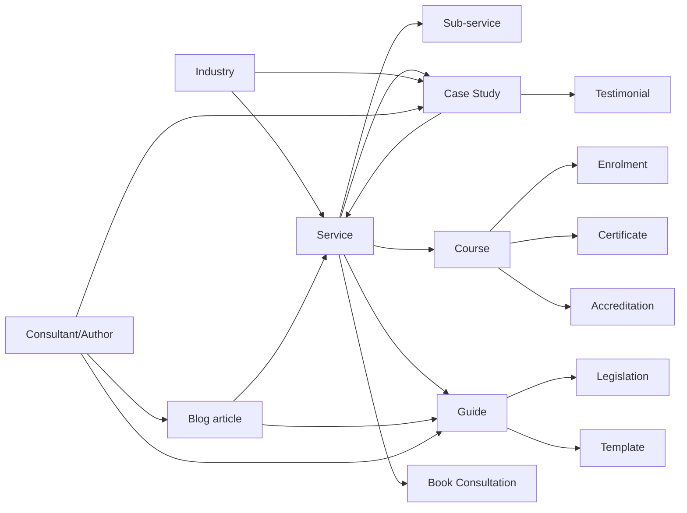

# Document 04 — Enterprise Information Architecture & Complete Sitemap

**Project:** CKBHSE Enterprise Digital Platform
**Document:** 04 — Information Architecture
**Version:** 1.0
**Status:** Authoritative blueprint for navigation, routing, page hierarchy, and user journeys.
**Audience:** Product Management, UX and UI Design, Frontend and Backend Engineering, QA, DevOps, Technical Writing.
**Grounded in:** Documents 01, 02 (BRS), 03 (Architecture Review), 03.5 (Engineering Standards), and the code at commit `c5c8197`.
**Constraint:** Documentation only. No routing implemented, no components built, no schema created.

---

## 1. Executive Summary

### 1.1 Purpose

This document defines where every piece of information in the CKBHSE platform lives, who may reach it, how it is found, and how it relates to everything else. It is the layer between the business requirements of Document 02 and the interfaces that will be designed and built next.

It exists because navigation is decided once and paid for forever. A route published to the public web accrues inbound links, bookmarks, and search rankings; changing it later costs redirects, lost ranking, and broken references. A navigation structure that works for eight pages and collapses at sixty forces a redesign precisely when the team is busiest. Both are cheap to avoid now and expensive to fix later, and the platform is at the last moment where they are still cheap.

### 1.2 Platform scope

BRS §4 defines six ecosystems. This document maps them to **five front-end applications** and one API, and specifies approximately **250 route patterns**: 70 on the public website, and the remainder distributed across four authenticated experiences.

What exists today is 11 public routes with a flat eight-item navigation bar and no About page. The gap is the subject of this document.

### 1.3 The framework question is now closed

Document 03 left one decision open and recommended option B (Next.js for the public marketing site only). **This brief resolves it as option A** by listing "React + Vite remains the frontend foundation" among the approved decisions this document must respect.

That is a legitimate call, and this document is written to it without reopening it. But it transfers a specific obligation onto the IA, and §14 treats it as a first-class requirement rather than a footnote: **the SEO characteristics that Next.js would have supplied by default must now be produced by explicit engineering.** Concretely, every public route in §4 must be prerendered to static HTML at build time and carry its own metadata, structured data, and canonical URL. Under option B that was a framework feature. Under option A it is a build-pipeline deliverable with a route inventory as its input — which is exactly what §4 provides. This is the reason the public sitemap is specified to the level of individual metadata ownership.

### 1.4 Navigation philosophy

Four principles govern every decision in this document.

**Task-first, not org-chart-first.** Navigation reflects what users are trying to do, not how CKBHSE is departmentally organised. A visitor looking for asbestos guidance does not care whether it is owned by Marketing or by a consultant.

**Breadth over depth.** A user finds things faster in a wide, shallow structure than a narrow, deep one, and search engines distribute authority better across it. §11 sets a hard four-segment ceiling and analyses every route against it.

**Recognition over recall.** Persistent navigation, breadcrumbs on anything three levels deep, and visible current-location indicators. Users should never need to remember where they came from.

**Every page justifies itself.** A page exists because it answers a question a real user asks. §4 explicitly names the pages a conventional corporate sitemap would include that this IA **deliberately omits** — thin pages that add navigation depth and dilute search authority while answering no question anyone has.

### 1.5 Information hierarchy

The platform separates information along two axes, and keeping them distinct is what prevents the sprawl that afflicts most enterprise platforms.

**By audience** — the public web, the client relationship, the learning experience, internal operations, and platform administration. Audience determines which application a page belongs to.

**By lifecycle** — evergreen reference material (services, guides, templates) behaves differently from chronological editorial (blog, news) and differently again from transactional records (projects, invoices, enrolments). Lifecycle determines caching, governance ownership, and whether a URL must remain stable forever.

Most IA failures come from conflating these: putting a transactional record in a marketing hierarchy, or organising evergreen reference material chronologically because the blog already worked that way.

### 1.6 Scalability approach

Three mechanisms carry this IA from 250 routes to whatever comes next.

**Content types, not pages.** `/knowledge/guides/<slug>` is one route serving unlimited guides. Adding the two-hundredth guide requires no routing change, no navigation change, and no deployment. Every collection in this document works this way.

**Reserved namespaces.** §19 allocates URL space for the ten future products in BRS §4 now, so that the AI Assistant and the Permit-to-Work system land in predictable places rather than wherever there was room.

**Facets instead of branches.** Where content could be organised two ways — by service and by industry, by topic and by format — the IA picks one canonical hierarchy and expresses the other as filters. This is the single most important scalability decision in the document, because duplicate paths to the same content multiply with every new dimension and split search authority between them.

---

## 2. Platform Ecosystem

### 2.1 Six ecosystems, five applications

BRS §4 describes six ecosystems, and this brief separates the Consultant Portal from the Staff Portal, giving seven experiences. They are delivered as **five front-end applications** against one Express API.

| #   | Application           | Workspace package          | Serves                                                  | Status               |
| --- | --------------------- | -------------------------- | ------------------------------------------------------- | -------------------- |
| 1   | Public Website        | `artifacts/ckbhse-website` | Guests, prospects, applicants, search engines           | Exists (11 routes)   |
| 2   | Client Portal         | `artifacts/client-portal`  | Registered Client                                       | Planned              |
| 3   | Training / LMS        | `artifacts/lms`            | Student, Trainer                                        | Planned              |
| 4   | Staff Portal          | `artifacts/staff-portal`   | Consultant, Operations, HR, Finance, Marketing, Support | Planned              |
| 5   | Administration Portal | `artifacts/admin-portal`   | Admin, Super Admin                                      | Planned              |
| —   | API                   | `artifacts/api-server`     | All of the above                                        | Exists (2 endpoints) |
| —   | Shared services       | `lib/*`                    | All of the above                                        | Partly exists        |

This matches Document 03's projection of four additional front ends, and it does so deliberately — see §2.3.

### 2.2 Ecosystem responsibilities

**Public Website.** Converts anonymous interest into qualified enquiry, and carries the platform's entire search-visibility obligation. It is the only ecosystem where SEO, prerendering, and page-load performance are product requirements rather than internal quality attributes. It owns the public course catalogue (because course pages are among the highest-intent search entry points) but not the learning experience itself.

**Client Portal.** The authenticated home of the commercial relationship: projects, audit reports, documents, invoices, bookings, and messaging. Its organising question is "what is happening with my compliance?" Data isolation is absolute here, per BRS §10 — this is the ecosystem where the tenant boundary is most exposed to users.

**Training / LMS.** Delivers accredited education to two distinct audiences in one application: learners consuming content and trainers authoring it. Kept separate from the Client Portal because a learner's relationship is with _content and assessment_, whereas a client's is with _an engagement_ — and because many learners are individuals with no client relationship at all.

**Staff Portal.** Internal operations: CRM, project delivery, scheduling, audit fieldwork, HR, approvals, and internal reporting. One application, role-scoped, presenting materially different surfaces to a consultant and to an operations manager.

**Administration Portal.** Platform governance rather than business operations: users, roles, permissions, content management, integrations, audit logs, and system health. Separated from the Staff Portal because its blast radius is the entire platform and its audience is two roles, not eight. A misclick in the Staff Portal affects one project; a misclick in the Administration Portal affects every tenant.

**Shared Services.** Not user-facing. The `lib/*` packages: the design system (`lib/ui`), the generated API client and validators, the data and domain layers, and authentication primitives. Their existence is why five applications do not mean five implementations of anything.

### 2.3 The Consultant Portal: one application, two experiences

The Document 04 brief asks for a Consultant Portal IA separately from the Staff Portal, and §6 delivers it in full. **Decision: it ships as a role-scoped experience within `artifacts/staff-portal`, not as a sixth deployed application.** This was raised as a recommendation during review and has been approved; it is binding for all subsequent design and implementation work.

The reasoning is straightforward. A consultant and an operations manager work on the same projects, the same clients, the same documents, the same calendar, and the same messages — they differ in scope and emphasis, not in subject matter. Two separate applications would mean two implementations of project views, document handling, scheduling, and messaging, kept in sync by hand. Document 03.5 §19.3 forbids exactly this, and the platform has already paid for that lesson once: the two existing front ends carried independent copies of 55 UI primitives that had forked onto different versions, and consolidating them deleted 6,479 lines.

So the IA documents the consultant experience separately, because the experience genuinely is distinct — different landing surface, different navigation, different default filters, different quick actions. The delivery is unified, because the data and components are the same. In practice this means one application at `/staff`, where navigation is composed from the acting user's permissions and the default landing route depends on their primary role.

The same reasoning applies within the LMS, where Trainer and Student are one application with two experiences.

### 2.4 Deployment topology: one origin, path prefixes

All five applications and the API are served from **a single origin**, distinguished by path prefix:

```
https://ckbhse.co.uk/            → Public Website
https://ckbhse.co.uk/portal      → Client Portal
https://ckbhse.co.uk/learn       → Training / LMS
https://ckbhse.co.uk/staff       → Staff Portal
https://ckbhse.co.uk/admin       → Administration Portal
https://ckbhse.co.uk/api/v1      → API
```

This is an IA decision with a security cause, and it is worth stating why rather than leaving it as infrastructure detail.

The authentication architecture is server-side sessions in `HttpOnly` cookies (Document 03 §"Authentication Review"). On a single origin those cookies are first-party and are sent automatically; CSRF defence reduces to `SameSite` plus an origin check; and the portals need no CORS entry at all. Subdomains would make every portal a cross-origin, credentialed caller — which requires `credentials: 'include'`, a CORS allowlist entry per portal, `SameSite=None` cookies, and a materially larger CSRF surface. Document 03 already identified that `customFetch` omits `credentials` entirely and would fail silently cross-origin (debt item D6); a single origin removes the whole class of problem instead of managing it.

The existing Vite configuration already anticipates sub-path serving through the `BASE_PATH` environment variable, so no application change is implied by this choice.

**Consequence for DevOps:** the edge must route by path prefix to four static bundles and one Node process. `.replit` currently declares an autoscale target with no build or run command (Document 03, debt item D19), so this topology is a prerequisite for first deployment rather than a later optimisation.

### 2.5 Cross-ecosystem boundaries

Three rules keep the ecosystems from bleeding into each other.

**A route belongs to exactly one application.** No route is served by two applications, and no content is duplicated across them. Where a client needs to reach a course, the Client Portal links to `/learn`; it does not reimplement the catalogue.

**Public content is never reachable only from behind a login.** Anything with search value lives on the public website. The portals link outward to it rather than embedding private copies, which would create an unindexed duplicate.

**Handover points are explicit.** A user crossing from one ecosystem to another does so through a deliberate, designed transition — enrolling on `/training/courses/<slug>` lands them in `/learn`, and that transition carries the enrolment context. These are the seams where journeys break, and §10 maps each one.

---

## 3. Global Navigation Strategy

Ten navigation mechanisms. Each is justified by the job it does; a mechanism without a distinct job is removed.

### 3.1 Primary navigation

**Public website.** The current eight-item flat bar (Home, Services, Industries, Training, Knowledge, Case Studies, Careers, Contact) will not survive the expansion to 79 public pages. It becomes **six items with grouped disclosure**:

| Item         | Contains                                                      | Rationale                                     |
| ------------ | ------------------------------------------------------------- | --------------------------------------------- |
| Services     | Service pillars, industries, compliance areas                 | The commercial core; the deepest branch       |
| Training     | Course catalogue, categories, accreditation, delivery formats | Second revenue stream, distinct search intent |
| Knowledge    | Guides, templates, policies, blog, downloads                  | The authority surface; highest page count     |
| About        | Company, leadership, accreditations, partners, careers        | Trust signals, grouped                        |
| Case Studies | Flat collection with filters                                  | Proof, high in the decision journey           |
| Contact      | Contact, offices, booking                                     | Conversion                                    |

Six is chosen deliberately over eight or ten. Primary navigation is scanned, not read, and each additional item reduces the likelihood that any single one is noticed. Grouping trades one interaction for a large reduction in scanning cost, and the group headings are themselves useful landing pages rather than empty menu parents.

**Book a Consultation** sits outside the six as a visually distinct persistent call to action, because it is the primary conversion goal and must never be more than one interaction away. It is not a navigation item competing for attention with Knowledge; it is the destination the whole site exists to reach.

**Portals.** Primary navigation is a persistent left sidebar on desktop, collapsing to a bottom bar or drawer on mobile. It is **composed from the acting user's resolved permissions**, never from a role name — Document 03.5 §10.1 is binding here. An item the user cannot use is not shown disabled; it is absent, because a disabled control invites a support ticket. The corollary in §15 matters: hiding navigation is presentation, and every route is authorised server-side regardless.

### 3.2 Secondary navigation

Within a section, secondary navigation exposes siblings without returning to the parent. On the public site this is an in-page section navigation on hub pages and a sibling list on detail pages ("Other services", "Related guides"). In the portals it is tabs within a record — a project's Overview, Timeline, Documents, and Invoices are tabs, not separate navigation destinations.

This is what keeps depth at four segments. A project's audit report is conceptually four levels down; presented as a tab within the project record, it costs the user one interaction rather than four, and §11 relies on this pattern to resolve every depth violation.

### 3.3 Utility navigation

Top-right, persistent, and deliberately small: search, notifications, account menu, and the portal switcher.

The **portal switcher** deserves explicit mention because it is easy to omit and expensive to retrofit. A single human may legitimately be a client contact and a learner, or a consultant and a learner. BRS §10 permits multiple roles with Super Admin approval. Without an explicit switcher, such a user has no way to move between `/portal` and `/learn` except by editing the URL, and no way to understand which context they are acting in. The switcher shows only contexts the user actually has, and is absent for the single-context majority.

### 3.4 Footer navigation

The footer is the safety net for everything that is important but not frequent: full section links, legal pages, the accessibility statement, the HTML sitemap, offices, accreditation logos, and social links.

It also carries real SEO weight as a site-wide internal linking surface, which is why §14 specifies what it must link to rather than leaving it to design. The footer is not a dumping ground; every link in it is either a legal obligation, a trust signal, or a deliberate authority-distribution decision.

### 3.5 Breadcrumbs

**Required on every route three or more segments deep.** They serve three distinct purposes, which is unusual for one component: orientation for users who arrived from search rather than the homepage; a one-click path up the hierarchy; and `BreadcrumbList` structured data that search engines display in results, improving click-through on deep pages.

Breadcrumbs reflect the **canonical hierarchy**, not the user's navigation history. A guide reached by filtering the knowledge hub by industry still shows `Home › Knowledge › Guides › <title>`, because breadcrumbs are a statement about where content lives, not about how this visitor happened to arrive. Making them history-dependent breaks both the structured data and the user's mental model.

### 3.6 Search strategy

Two distinct searches with different indexes and different rules, covered fully in §13.

**Public search** (`/search`) indexes only published public content and requires no authentication.

**Portal search** is permission-filtered at query time. This is the single most security-sensitive component in the platform: a search index is a denormalised copy of everything, and an index that is not permission-aware is a cross-tenant data-leak vector that bypasses every repository-level control. Document 03 flagged this; §13.6 specifies the mitigation.

### 3.7 Quick actions

A small, context-aware set of primary actions, surfaced prominently rather than buried in a record. On the public site the quick action is always booking or enquiry. In the portals it is role-dependent: a client uploads a requested document or books a follow-up; a consultant files a finding or starts an inspection; an operations manager assigns a consultant.

Quick actions are limited to three per context. A fourth means the context has no primary action, and presenting four equally-weighted options is the same as presenting none.

### 3.8 Persistent navigation

Some elements never disappear regardless of location: the logo linking home, primary navigation, search entry, and the account menu when authenticated. Modal and full-screen states are the only exceptions, and they must offer an unambiguous exit.

The specific failure this prevents is a user reaching a deep page from search, finding nothing they recognise, and leaving. Persistent navigation guarantees that every page is a viable entry point — which matters because, for a site with 56 indexed route patterns, most sessions will not begin at the homepage.

### 3.9 Context navigation

Navigation derived from the current record rather than the site structure: a project's related audits, a course's prerequisites, an invoice's originating project, a guide's related services. It is the mechanism by which the content relationships in §12 become usable rather than merely documented.

Its value is highest in the portals, where it replaces navigation with direct traversal — a consultant moving from a finding to its corrective action to the client contact responsible should never pass through a list page.

### 3.10 Mobile navigation

BRS §9 requires mobile-first, and this platform has a specifically mobile use case: consultants conducting inspections on site, often one-handed, sometimes with poor connectivity.

**Public site:** a drawer menu with the six groups expandable in place, and Book a Consultation pinned visible within the drawer rather than requiring a scroll. The existing implementation already closes the menu on navigation, including browser back and forward.

**Portals:** a bottom tab bar carrying the four highest-frequency destinations for the acting role, with the remainder in a "More" drawer. Bottom placement is a reachability decision, not a stylistic one — top-anchored navigation is hard to reach one-handed on a large phone, which is precisely the inspection scenario.

Every navigation element meets a 44×44 px minimum touch target. Hover is never the only way to reveal a menu, since it does not exist on touch. Both requirements are WCAG 2.2 AA obligations under §18, not preferences.

---

## 4. Complete Public Website Sitemap

70 route patterns — 49 static and 21 dynamic templates. `<slug>` denotes a dynamic parameter served by one route template.

**Legend:** **P** prerendered static at build time · **D** dynamic, prerendered per content item · **N** `noindex`

### 4.1 Home and top level

```
/                                        Home                                  P
/search                                  Search results                        N
/sitemap                                 HTML sitemap (human-readable)         P
/faq                                     Frequently asked questions            P
/pricing                                 Pricing and engagement models         P
/book-consultation                       Consultation booking                  P
/contact                                 Contact and offices                   P
```

`/book-consultation` is top-level rather than nested under `/contact` because it is the primary conversion goal, the destination of paid campaigns, and a distinct search intent ("book HSEQ consultant"). Nesting it would cost a segment and bury it.

### 4.2 About

```
/about                                   Who we are, mission, vision, history  P
/about/leadership                        Leadership team                       P
/about/leadership/<slug>                 Individual leader profile             D
/about/accreditations                    Accreditations and memberships        P
/about/partners                          Partners and affiliations             P
/about/offices                           Locations and coverage                P
```

**Deliberately omitted:** separate `/about/mission`, `/about/vision`, and `/about/history` pages. The brief lists these, and a conventional corporate sitemap would include them, but each would be a short page that no user searches for and that dilutes the authority of `/about` while adding a navigation level. They are sections within `/about`, addressable by anchor for direct linking. This is the "every page justifies itself" principle applied against convention: three pages removed, no user question left unanswered.

`/about/leadership/<slug>` is retained as a real page type because named individuals attract direct search and carry `Person` structured data.

### 4.3 Services

The commercial core, and the deepest public branch.

```
/services                                Services overview hub                 P
/services/<slug>                         Service pillar detail                 D
/services/<slug>/<sub-slug>              Named sub-service                     D
```

Service pillars, following BRS §3 and §4:

```
/services/health-and-safety
/services/health-and-safety/audits
/services/health-and-safety/risk-assessments
/services/health-and-safety/method-statements
/services/health-and-safety/cdm-advisory
/services/environmental
/services/environmental/impact-assessments
/services/environmental/waste-management
/services/environmental/carbon-reporting
/services/quality-management
/services/quality-management/iso-9001
/services/quality-management/internal-audits
/services/compliance
/services/compliance/gap-analysis
/services/compliance/documentation
/services/compliance/legal-register
/services/consultancy
/services/consultancy/retained-advisory
/services/consultancy/interim-resource
/services/audits
/services/audits/supplier-audits
/services/audits/accreditation-support
```

Three segments maximum. A sub-service exists as a page only where it has independent search demand and substantive content; otherwise it is a section of its pillar. This test must be applied when the catalogue grows, or the branch will silently deepen.

### 4.4 Industries

```
/industries                              Industries overview                   P
/industries/<slug>                       Industry detail                       D
```

```
/industries/construction
/industries/manufacturing
/industries/logistics-and-transport
/industries/energy-and-utilities
/industries/healthcare
/industries/education
/industries/facilities-management
/industries/food-and-beverage
```

**Industry is deliberately flat, and industry pages do not nest services.** A page at `/industries/construction/health-and-safety` would duplicate `/services/health-and-safety` with different framing — two URLs competing for the same query, splitting authority, and doubling the maintenance surface. Instead an industry page _links_ to relevant services and filters case studies by sector. This is the facet-not-branch rule from §1.6, and Services is chosen as the canonical hierarchy because that is how the commercial offer is actually structured.

### 4.5 Training (public surface)

The public catalogue lives on the website; the learning experience lives at `/learn` (§9). Course pages are among the highest-intent entry points on the platform.

```
/training                                Training overview hub                 P
/training/courses                        Full course catalogue, filterable     P
/training/courses/<slug>                 Course detail, enrol, dates, price    D
/training/categories/<slug>              Category landing                      D
/training/accreditations/<slug>           Accrediting body landing              D
/training/delivery/<slug>                Delivery format landing               D
/training/schedule                       Upcoming public course dates          P
/training/in-house                       In-house and bespoke training         P
/training/verify                         Public certificate verification       N
```

Categories, accreditations, and delivery formats are **facet landing pages, not hierarchy**. A course is reached canonically at `/training/courses/<slug>`; the facet pages are curated collections that rank for their own queries ("IOSH courses", "online NEBOSH") and link into the catalogue. Each declares a canonical URL pointing at itself, and each course appears in exactly one canonical location. Without this discipline, a course reachable at four URLs splits its ranking four ways.

`/training/verify` supports the BRS §10 requirement that certificates be independently verifiable. It is public by necessity — an employer verifying a certificate has no account — and `noindex` because it is a tool, not content. It must not enumerate: it confirms a supplied identifier and reveals nothing else.

### 4.6 Case studies and testimonials

```
/case-studies                            Collection, filter by service/sector  P
/case-studies/<slug>                     Case study detail                     D
/testimonials                            Client testimonials                   P
```

Flat and filtered rather than nested under service or industry, for the reason in §4.4. Both content types require recorded client approval before publication — a legal gate, per Document 03 §"Entity Analysis", not an editorial preference.

### 4.7 Knowledge Centre

The authority surface and the highest-volume content area.

```
/knowledge                               Knowledge hub, all types, filterable  P
/knowledge/guides                        Guides collection                     P
/knowledge/guides/<slug>                 Guide detail                          D
/knowledge/templates                     Downloadable templates                P
/knowledge/templates/<slug>              Template detail and download          D
/knowledge/policies                      Policy documents and guidance         P
/knowledge/policies/<slug>               Policy detail                         D
/knowledge/legislation                   Legislation and standards explained   P
/knowledge/legislation/<slug>            Individual regulation explained       D
/knowledge/glossary                      HSEQ glossary                         P
/knowledge/glossary/<slug>               Term definition                       D
```

**Blog is separate from Knowledge**, at top level:

```
/blog                                    Blog index, paginated                 P
/blog/<slug>                             Article                               D
/blog/category/<slug>                    Category archive                      D
/blog/tag/<slug>                         Tag archive                           N
/blog/author/<slug>                      Author archive                        D
/news                                    Company and industry news             P
/news/<slug>                             News item                             D
```

The split is principled, not stylistic. Blog is **chronological and editorial** — owned by Marketing, dated, superseded over time, with recency as a ranking factor. Knowledge is **evergreen and reference** — authored by consultants, maintained rather than replaced, and expected to rank for years. They have different governance owners (§17), different review cycles, different caching, and different URL stability guarantees. Merging them subordinates permanent reference material to a chronological structure that actively harms it.

Tag archives are `noindex` because they generate near-duplicate thin pages at scale; category archives are indexed because they are curated and few.

**Deliberately omitted:** separate `/knowledge/downloads` and `/knowledge/resources` branches, both of which the brief lists. These are **formats, not topics**. A template is a download; a guide may be a download. Creating a parallel format hierarchy means every downloadable item has two URLs, which splits authority and doubles maintenance. Downloadable material is surfaced as a filter on `/knowledge` and as a section within each item's page.

### 4.8 Careers

```
/careers                                 Working at CKBHSE, culture, benefits  P
/careers/vacancies                       Open vacancies                        P
/careers/vacancies/<slug>                Vacancy detail                        D
/careers/vacancies/<slug>/apply          Application form                      N
/careers/application-status              Applicant status lookup               N
```

Vacancy pages carry `JobPosting` structured data and are syndicated to job aggregators, which is why the detail page is a distinct indexed route rather than a modal on the listing.

The apply route is `noindex` and is the platform's **highest-risk unauthenticated write surface** — an anonymous file upload. §15 and Document 03.5 §11.5 govern it.

### 4.9 Legal and compliance

```
/legal                                   Legal and policy index               P
/legal/privacy                           Privacy policy (GDPR)                P
/legal/terms                             Terms and conditions                  P
/legal/cookies                           Cookie policy and preferences        P
/legal/accessibility                     Accessibility statement (WCAG 2.2 AA)P
/legal/modern-slavery                    Modern slavery statement             P
/legal/data-processing                   Data processing addendum             P
/legal/complaints                        Complaints procedure                 P
```

Grouped under `/legal` rather than left at top level. The current site has three of these as top-level routes (`/privacy-policy`, `/terms-conditions`, `/cookie-policy`); grouping keeps the root namespace clear as the set grows, which it will — UK B2B compliance obligations accumulate.

**This requires three permanent redirects (§16.6).** Because the site is not yet publicly launched — the contact form discards submissions and metadata is still placeholder — these URLs carry no inbound links or ranking today. **This is the last moment the change is free.** After launch each rename costs a redirect chain and some link equity.

`/legal/accessibility` is a WCAG 2.2 AA conformance obligation, not optional, and §18 defines its required contents.

### 4.10 Conversion, system, and error routes

```
/enquiry/submitted                       Enquiry confirmation                  N
/booking/confirmed                       Booking confirmation                  N
/careers/application/submitted           Application confirmation              N
/newsletter/confirmed                    Subscription double-opt-in confirmed  N
/newsletter/unsubscribe                  One-click unsubscribe                 N
/404                                     Not found                             N
/500                                     Application error                     N
/maintenance                             Planned maintenance                   N
/offline                                 Offline fallback                      N
```

Confirmations are **distinct URLs rather than in-place state changes**, because conversion tracking and funnel analytics need a page view to fire against, and a query parameter is unreliable for goal configuration. They are `noindex`, and when reached without the preceding action they render generic content rather than a false confirmation.

Three technical distinctions that IA documents routinely get wrong, and that matter for who builds what:

- **`/404`** is served by the SPA's catch-all route, and the edge must return HTTP 404 for unmatched paths rather than 200 with an error page, or search engines index soft 404s.
- **`/500`** is a React error boundary, not a route. A genuine server or asset-delivery failure cannot be rendered by the application that failed; the edge must serve a static fallback.
- **`/maintenance`** and **`/offline`** are likewise served by the edge and the service worker respectively. **These three are DevOps deliverables, not frontend routes**, and assigning them to the wrong team is how a platform ends up with no working error page.

### 4.11 Route count summary

| Section                    | Static routes | Dynamic templates | Notes                             |
| -------------------------- | ------------- | ----------------- | --------------------------------- |
| Home and top level         | 7             | 0                 |                                   |
| About                      | 5             | 1                 | 3 pages deliberately omitted      |
| Services                   | 1             | 2                 | 21 named pillars/sub-services     |
| Industries                 | 1             | 1                 | 8 industries, flat                |
| Training (public)          | 5             | 4                 | Catalogue plus 3 facet types      |
| Case studies, testimonials | 2             | 1                 |                                   |
| Knowledge Centre           | 6             | 5                 | 2 branches deliberately omitted   |
| Blog and news              | 2             | 5                 | Separate lifecycle from Knowledge |
| Careers                    | 3             | 2                 | Includes unauthenticated upload   |
| Legal                      | 8             | 0                 | 3 redirects required              |
| Conversion, system, error  | 9             | 0                 | 3 owned by DevOps                 |
| **Total**                  | **49**        | **21**            | **70 addressable route patterns** |

The 22 named service pages in §4.3 and 8 industry pages in §4.4 are **content instances** served by the dynamic templates, not additional patterns. Counting them, the public site launches with **79 concrete URLs** plus unbounded template-served content (guides, articles, courses, case studies, vacancies).

Of the 70 patterns, 14 are `noindex`, leaving **56 route patterns that must be prerendered with their own metadata** (§14). That is the concrete deliverable this inventory exists to scope.

---

## 5. Client Portal IA

**Base:** `/portal` · **Audience:** Registered Client · **Organising question:** "What is happening with my compliance?"

Every route is scoped to the acting user's organisation by the repository layer, per BRS §10 and Document 03.5 §3. No route accepts an organisation identifier as a parameter — a route that did would be a route that could be given the wrong one.

### 5.1 Route map

```
/portal                                  Dashboard
/portal/projects                         Project list
/portal/projects/<id>                    Project record (tabbed)
/portal/projects/<id>/timeline           Consultancy timeline
/portal/projects/<id>/documents          Project documents
/portal/projects/<id>/audits/<auditId>   Audit report detail
/portal/tasks                            Actions requested of the client
/portal/documents                        Document library, all projects
/portal/documents/<id>                   Document detail and version history
/portal/certificates                     Team certificates and expiry
/portal/certificates/<id>                Certificate detail and download
/portal/invoices                         Invoice list
/portal/invoices/<id>                    Invoice detail and payment
/portal/bookings                         Upcoming and past bookings
/portal/bookings/new                     Book a follow-up consultation
/portal/messages                         Message threads
/portal/messages/<threadId>              Thread detail
/portal/notifications                    Notification centre
/portal/compliance-calendar              Obligations and renewal dates
/portal/training                         Organisation training overview
/portal/support                          Support tickets and help
/portal/support/<ticketId>               Ticket detail
/portal/company                          Company profile
/portal/company/users                    User management (client admin only)
/portal/company/users/<id>               User detail and role
/portal/activity                         Activity log for the organisation
/portal/settings                         Personal preferences
/portal/settings/security                Password, MFA, active sessions
/portal/settings/notifications           Notification preferences
```

### 5.2 The dashboard is a router, not a report

`/portal` answers three questions in priority order: **what needs my attention**, **what is in progress**, and **what changed recently**. It is composed of entry points into the sections below, not a static summary — a dashboard that only displays is a dead end that users bypass within a fortnight.

"Needs attention" aggregates from four sources that are otherwise scattered: outstanding tasks, unpaid invoices, expiring certificates, and unread messages. This aggregation is the dashboard's entire justification, and it is why the compliance calendar and the task list remain separate destinations rather than being folded into it.

### 5.3 Key relationships

**Project is the spine.** A project owns its timeline, its documents, its audits and their findings, and the invoices raised against it. Everything else in the portal is either a cross-project view of the same data (`/portal/documents` is every project's documents in one list) or a different concern entirely (training, company profile).

This produces a deliberate duality: an audit report is reachable at `/portal/projects/<id>/audits/<auditId>` (in context) and appears in `/portal/documents` (as an artifact). These are two paths to one record, which §4.4 warned against for public content — but the rule differs here, because there is no search authority to split and the two views serve genuinely different tasks. The canonical route is the in-project one; the document library links to it rather than rendering a second detail view.

**Tasks are the client's obligations, not the consultant's.** `/portal/tasks` shows only what CKBHSE is waiting on from the client — requested evidence, a signature, an approval. Corrective actions assigned to CKBHSE consultants live in the Staff Portal and surface here only as project timeline events. Conflating the two produces a task list the client cannot act on.

**Certificates are organisation-wide, not per-learner.** A client cares which of their staff are certified and what is expiring, which is a compliance view. The learner's own view of the same certificate is in the LMS at `/learn/certificates`.

**Compliance calendar is derived, never authored.** Its entries come from certificate expiry, audit cycles, and project milestones. It is a projection, which is why it has no create route.

### 5.4 Client-side user management

`/portal/company/users` is visible only to a client contact holding the client-administrator permission. This is delegated administration within a tenant, and it is distinct from the Administration Portal: a client admin manages their own colleagues' access to their own organisation's data, and can grant no permission they do not themselves hold. The distinction matters because conflating it with platform administration is a privilege-escalation path.

---

## 6. Consultant Portal IA

**Base:** `/staff` · **Audience:** HSEQ Consultant · **Delivery:** role-scoped experience within the Staff Portal application — approved decision, per §2.3 · **Organising question:** "What am I doing today, and for whom?"

### 6.1 Route map

Routes shared with other internal roles are marked **(shared)**; the consultant's view is filtered to their assignments.

```
/staff                                   Dashboard (consultant default view)
/staff/my-clients                        Assigned clients
/staff/my-clients/<id>                   Client record (shared, scoped)
/staff/projects                          Assigned projects (shared, filtered)
/staff/projects/<id>                     Project record (shared)
/staff/projects/<id>/findings            Findings and corrective actions
/staff/audits                            Audit worklist
/staff/audits/<id>                       Audit record
/staff/audits/<id>/fieldwork             On-site capture (mobile-first)
/staff/audits/<id>/report                Report drafting and issuance
/staff/inspections                       Inspection worklist
/staff/inspections/<id>                  Inspection record
/staff/incidents                         Incidents for assigned clients
/staff/incidents/<id>                    Incident investigation
/staff/risk-assessments                  Risk assessment worklist
/staff/risk-assessments/<id>             Assessment detail and approval
/staff/actions                           My corrective actions
/staff/calendar                          Personal and team calendar (shared)
/staff/meetings                          Meetings and site visits
/staff/tasks                             Personal task list (shared)
/staff/documents                         Document library (shared, scoped)
/staff/knowledge                         Internal knowledge base (shared)
/staff/knowledge/<slug>                  Internal article
/staff/training                          My competencies and CPD
/staff/messages                          Client and internal messaging (shared)
/staff/notifications                     Notification centre (shared)
/staff/profile                           Profile and competencies
/staff/settings                          Preferences and security
```

### 6.2 Fieldwork is the design constraint

`/staff/audits/<id>/fieldwork` is the most demanding route in the platform and should be designed first, because it is the only one used **on a construction site, one-handed, in gloves, with intermittent connectivity**. Every other internal route is used at a desk.

Its requirements differ in kind, not degree: large touch targets well beyond the 44 px minimum, photographic evidence capture, resilience to connection loss mid-session, and no dependency on a request completing before the user can continue. Document 03 §"Domain Model" notes that offline-tolerant capture implies idempotent submission with client-supplied keys — an IA consequence, because it means the fieldwork route must be able to queue and replay rather than assuming a live round trip.

Designing this route as a desktop form and adapting it for mobile will fail. It is the case that justifies the "mobile-first" principle being a requirement rather than an aspiration.

### 6.3 Separation of drafting from issuance

`/staff/audits/<id>/report` distinguishes drafting from issuance as separate states with separate permissions, because Document 03 establishes that **an issued audit report is immutable** — a client may have acted on it. Corrections produce a new version; the issued artifact never changes.

Issuance is therefore a deliberate, audited, permission-gated transition rather than a save. §16 models it as the creation of a sub-resource for exactly this reason.

### 6.4 Scope, and why it is not a filter

A consultant sees clients, projects, and documents **for their assignments**. This is enforced by the repository layer from the authorisation context, not by a query parameter or a UI filter the user could change. The navigation shows no route the consultant cannot use, and every route re-derives scope server-side regardless of what the client sends.

`/staff/my-clients` and `/staff/projects` are therefore not "filtered views of all clients" — from the consultant's authorisation context they are the complete list. The distinction is invisible in the interface and fundamental in the implementation.

---

## 7. Staff Portal IA

**Base:** `/staff` · **Audience:** Operations Manager, HR, Finance, Marketing, Customer Support, and Consultants (§6) · **Organising question:** "How is the business running?"

One application, five to six role-scoped experiences. Navigation is composed from resolved permissions, so an HR user and a Finance user see substantially different applications at the same URL prefix.

### 7.1 Route map

```
/staff                                   Dashboard (role-dependent default)

CRM and clients
/staff/crm                               Pipeline and enquiries
/staff/crm/enquiries                     Inbound contact requests
/staff/crm/enquiries/<id>                Enquiry triage and conversion
/staff/crm/leads/<id>                    Lead record
/staff/clients                           All clients
/staff/clients/<id>                      Client record
/staff/clients/<id>/contacts             Client contacts
/staff/clients/<id>/projects             Client projects
/staff/clients/<id>/invoices             Client billing history

Delivery
/staff/projects                          All projects
/staff/projects/new                      Create project
/staff/projects/<id>                     Project record
/staff/projects/<id>/assignments         Consultant assignment
/staff/assignments                       Assignment board and capacity
/staff/scheduling                        Resource scheduling
/staff/scheduling/availability           Consultant availability
/staff/bookings                          Consultation bookings
/staff/bookings/<id>                     Booking detail

Approvals and operations
/staff/approvals                         Approval queue
/staff/approvals/<id>                    Approval detail
/staff/operations                         Operational overview
/staff/actions                           Corrective action tracker

HR
/staff/hr                                HR overview
/staff/hr/people                         Staff directory
/staff/hr/people/<id>                    Staff record
/staff/hr/competencies                   Competency and expiry matrix
/staff/hr/recruitment                    Vacancies
/staff/hr/recruitment/<id>               Vacancy and applicants
/staff/hr/applications/<id>              Application detail
/staff/hr/onboarding                     Onboarding checklists
/staff/hr/absence                        Absence and availability

Finance
/staff/finance                           Finance overview
/staff/finance/invoices                  Invoice management
/staff/finance/invoices/<id>             Invoice detail
/staff/finance/invoices/new              Raise invoice
/staff/finance/payments                  Payments and reconciliation
/staff/finance/refunds                   Refund processing
/staff/finance/subscriptions             Retainers and subscriptions

Marketing
/staff/marketing                         Marketing overview
/staff/marketing/campaigns               Campaigns
/staff/marketing/newsletter              Newsletter and lists
/staff/marketing/leads                   Lead attribution

Support
/staff/support                           Support queue
/staff/support/<ticketId>                Ticket detail

Shared
/staff/documents                         Internal document library
/staff/reporting                         Operational reporting
/staff/reporting/<slug>                  Named report
/staff/announcements                     Internal announcements
/staff/calendar  /staff/tasks  /staff/messages  /staff/notifications
/staff/knowledge  /staff/profile  /staff/settings
```

### 7.2 Role-dependent landing

The same URL, `/staff`, resolves to a different dashboard per primary role: an operations manager sees capacity, at-risk projects, and the approval queue; HR sees recruitment and expiring competencies; Finance sees overdue invoices and unreconciled payments; a consultant sees today's fieldwork (§6).

This is preferable to five separate dashboard URLs, because a user's primary role is stable and the extra segment would be pure ceremony. Users holding multiple roles switch via the portal switcher (§3.3).

### 7.3 CRM and the first persistence requirement

`/staff/crm/enquiries` consumes submissions from the public `/contact` and `/book-consultation` forms. **This is the platform's first real persistence requirement**: the contact form currently discards every submission, which is one of the two launch gates carried since Phase 0.

The IA consequence is a defined path from anonymous enquiry to client: enquiry → triage → lead → client → project. Each transition is auditable and permission-gated, and BRS §10's unique reference number is assigned at project creation.

### 7.4 Approvals as a first-class destination

`/staff/approvals` is a single cross-domain queue rather than approval buttons scattered across modules. Audit report issuance, invoice authorisation, case study publication, multi-role grants, and refunds all surface here.

Centralising them means an approver has one place to look and the platform has one auditable record of who approved what. Scattering approvals across the modules that generate them guarantees that some are never actioned, because nobody knows where to look.

### 7.5 HR boundary

HR routes are visible only with HR permissions and are **not** visible to Operations, despite both being internal. Staff records, absence, and applications are confidential personal data with retention obligations distinct from operational data. Document 03 keeps People & Recruitment as a separate bounded context precisely so this boundary is structural rather than a UI convention.

---

## 8. Administration Portal IA

**Base:** `/admin` · **Audience:** Admin, Super Admin · **Organising question:** "Is the platform healthy, correct, and secure?"

Separated from the Staff Portal because the blast radius is the entire platform rather than one project. Every action here is audited without exception.

### 8.1 Route map

```
/admin                                   System dashboard

Identity and access
/admin/users                             User directory
/admin/users/<id>                        User detail
/admin/users/<id>/roles                  Role assignment
/admin/users/<id>/sessions               Active sessions and revocation
/admin/users/invite                      Invite user
/admin/roles                             Role catalogue
/admin/roles/<id>                        Role detail and permission set
/admin/permissions                       Permission catalogue (read-mostly)
/admin/organizations                     Tenant directory
/admin/organizations/<id>                Tenant detail and entitlements

Content management
/admin/cms                               CMS overview
/admin/cms/pages                         Website pages
/admin/cms/pages/<id>                    Page editor with version history
/admin/cms/navigation                    Menu and navigation structure
/admin/cms/blog                          Blog and news
/admin/cms/blog/<id>                     Article editor
/admin/cms/knowledge                     Knowledge Centre content
/admin/cms/case-studies                  Case studies (client approval gate)
/admin/cms/testimonials                  Testimonials (client approval gate)
/admin/cms/services                      Service catalogue content
/admin/cms/industries                    Industry pages
/admin/cms/faq                           FAQ management
/admin/cms/redirects                     Redirect management
/admin/cms/seo                           Metadata, sitemaps, structured data
/admin/media                             Media library
/admin/media/<id>                        Asset detail and usage

Training administration
/admin/training                          Training overview
/admin/training/courses                  Course management
/admin/training/courses/<id>             Course editor
/admin/training/courses/<id>/versions    Version history (enrolment pinning)
/admin/training/enrollments              Enrolment administration
/admin/training/certificates             Certificate issuance and revocation
/admin/training/accreditations           Accrediting bodies
/admin/training/schedule                 Public course dates

Business administration
/admin/consultancy                       Consultancy configuration
/admin/projects                          Cross-tenant project oversight
/admin/invoices                          Invoice administration
/admin/payments                          Payment administration
/admin/subscriptions                     Plans and entitlements
/admin/pricing                           Pricing configuration

Insight
/admin/reports                           Report library
/admin/reports/<slug>                    Named report
/admin/analytics                         Platform analytics
/admin/audit-logs                        Audit log explorer
/admin/audit-logs/<id>                   Audit entry detail

Platform operations
/admin/system                            System health
/admin/system/jobs                       Background jobs and queues
/admin/system/queues                     Queue depth and failures
/admin/system/cache                      Cache management
/admin/notifications                     Notification administration
/admin/notifications/templates           Notification templates
/admin/email-templates                   Email templates
/admin/integrations                      Third-party integrations
/admin/integrations/<slug>               Integration configuration
/admin/api-keys                          API key management
/admin/webhooks                          Webhook endpoints and delivery log
/admin/feature-flags                     Feature flags

Security and configuration (Super Admin)
/admin/security                          Security overview
/admin/security/policies                 Password and session policy
/admin/security/mfa                      MFA enforcement per role
/admin/security/events                   Security event log
/admin/security/access-reviews           Periodic access review
/admin/backups                           Backup status and restore
/admin/environment                       Environment configuration (read-mostly)
/admin/settings                          Platform settings
/admin/settings/legal                    Legal document versions
```

### 8.2 Audit log explorer is the most important route here

`/admin/audit-logs` is what makes BRS §10's immutability requirement usable. An immutable log nobody can query satisfies the letter of the rule and none of its purpose, which is answering "who changed this, when, and what did it look like before".

It requires filtering by actor, action, target entity, organisation, and time range, plus correlation by the `requestId` that already flows through the error envelope and application logs. It is **read-only by construction** — no edit or delete affordance exists, because `UPDATE` and `DELETE` are revoked from the application's database role (Document 03.5 §12.7).

### 8.3 Permissions are viewed here, not authored here

`/admin/permissions` is read-mostly. The permission catalogue is seeded through migrations so it is versioned, reviewable in pull requests, and diffable, per Document 03.5 §10.1. Allowing runtime creation of permissions would put the authorisation model outside version control, and an authorisation model nobody can review is not one anybody can trust.

Roles, by contrast, are composed at runtime at `/admin/roles/<id>` from existing permissions, because bundling is a business decision. Composition is audited and, for multi-role grants, requires Super Admin approval per BRS §10.

### 8.4 Cross-tenant visibility is the exception that needs care

`/admin/organizations`, `/admin/projects`, and `/admin/invoices` are the only routes in the platform that intentionally cross the tenant boundary. They are therefore the routes where BRS §10's isolation rule is deliberately suspended, which makes them the highest-risk surface in the Administration Portal.

They require a platform-scope permission, log every access — not merely every mutation — and should present tenant context unmistakably in the interface, because the most likely failure mode is an administrator believing they are looking at one tenant while acting on another.

### 8.5 Super Admin separation

Security policy, backups, environment configuration, and access review are Super Admin only, per BRS §6's "Full System" access level. The separation exists so that day-to-day administration does not require the credentials that can alter the platform's security posture.

`/admin/environment` is read-mostly by design: configuration is validated at boot from the environment schema (Document 03.5 §7.3), and a runtime override path would bypass that validation and the boot-time failure that makes misconfiguration obvious.

---

## 9. LMS Information Architecture

**Base:** `/learn` · **Audience:** Student, Trainer · **Public catalogue:** `/training` on the website (§4.5)

Two experiences in one application. The split from the public catalogue is deliberate: `/training/courses/<slug>` is a marketing and conversion page that must be indexed and fast; `/learn/courses/<id>` is an authenticated delivery surface that must not be.

### 9.1 Learner routes

```
/learn                                   Learning dashboard
/learn/courses                           My enrolled courses
/learn/courses/<id>                      Course home and structure
/learn/courses/<id>/lessons/<lessonId>   Lesson player
/learn/courses/<id>/resources            Course downloads
/learn/courses/<id>/discussion           Course discussion (future)
/learn/assignments                       Assignments across courses
/learn/assignments/<id>                  Assignment detail and submission
/learn/quizzes/<id>                      Quiz attempt
/learn/quizzes/<id>/results              Attempt result and feedback
/learn/progress                          Progress across all courses
/learn/certificates                      My certificates
/learn/certificates/<id>                 Certificate detail and download
/learn/transcript                        Full learning transcript
/learn/achievements                      Badges and milestones
/learn/bookmarks                         Saved lessons and resources
/learn/downloads                         All downloadable material
/learn/catalogue                         Browse and enrol (authenticated)
/learn/profile                           Learner profile
/learn/settings                          Preferences and accessibility
```

### 9.2 Trainer routes

```
/learn/instructor                        Instructor dashboard
/learn/instructor/courses                My courses
/learn/instructor/courses/<id>           Course builder
/learn/instructor/courses/<id>/modules   Module and lesson structure
/learn/instructor/courses/<id>/learners  Enrolled learners and progress
/learn/instructor/courses/<id>/versions  Version management
/learn/instructor/assessments            Assessment and question banks
/learn/instructor/assessments/<id>       Assessment editor
/learn/instructor/marking                Marking queue
/learn/instructor/marking/<id>           Mark a submission
/learn/instructor/certificates           Issue and manage certificates
/learn/instructor/reports                Cohort and outcome reporting
```

The `/learn/instructor` prefix is a deliberate namespace rather than a separate application, so that a person who both teaches and learns keeps one session, one profile, and one set of notifications.

### 9.3 The lesson player is the only route with a nested identifier

`/learn/courses/<id>/lessons/<lessonId>` is five segments with two dynamic parameters — the deepest route in the platform, and the one place where the pattern is justified. A lesson has no meaning outside its course, its position in the sequence drives progress tracking, and a bare `/learn/lessons/<id>` would lose the context needed to render navigation, prerequisites, or the progress bar.

§11 accepts this as the single sanctioned exception.

### 9.4 Course versioning is an IA constraint, not only a data one

Document 03 establishes that **enrolments pin a course version**, so that published content changing does not invalidate in-progress learners. This has a direct navigational consequence: `/learn/courses/<id>` renders the structure of _the version the learner is enrolled on_, which may differ from what `/training/courses/<slug>` advertises publicly today.

This is not an edge case, it is the normal state of any course that has ever been updated. Designers and engineers must treat the learner's course structure as version-scoped, or learners will encounter lessons that no longer exist.

### 9.5 Video and progress

Video is never served through the API. Lessons reference media delivered by CDN through signed, expiring URLs (Document 03 §"Scalability Review"), and the player requests an access grant from the API rather than a file.

Progress writes are the highest-frequency operation in the platform — potentially every few seconds of playback. The IA implication is that the lesson player must function as a long-lived surface with throttled background persistence, not as a page that saves on navigation. A design that persists progress only on lesson completion will lose position on every abandoned session.

### 9.6 Certificates appear in three places, deliberately

The same certificate is reachable at `/learn/certificates/<id>` (the learner's credential), `/portal/certificates` (the client's compliance view of their staff), and `/training/verify` (public verification by a third party).

Three audiences, three questions, one immutable record. The certificate is generated once and stored; none of these views regenerates it, because regenerating from live data would change a legal artifact when the course changes.

---

## 10. User Journey Mapping

Seven journeys. Each names its entry points, decision points, primary tasks, exit points, and success outcome. The **handover points** — where a user crosses from one ecosystem to another — are called out because they are where journeys break.

### 10.1 Visitor (Guest)

**Entry.** Organic search onto a deep page (the majority case, not the homepage), a service or industry landing page from paid campaigns, a shared guide or case study, or direct navigation for brand searches.

**Decision points.** Is this company credible? Do they understand my industry? Can they solve my specific problem? What will it cost? Should I commit to contact?

**Primary tasks.** Understand the offer, verify credibility through accreditations and case studies, find industry-relevant proof, consume a guide, and locate a next step.

**Exit points.** Convert via `/book-consultation` or `/contact`; partially convert via a newsletter subscription or template download; leave, ideally having bookmarked something.

**Success outcome.** A qualified enquiry, or an email address plus a reason to return.

**IA implications.** Because most sessions begin on a deep page, **every page is a landing page**: persistent navigation, breadcrumbs, and a visible next step are mandatory everywhere, not just on hubs. The guide-to-service-to-booking path in §12 is the primary conversion route and must be present as explicit in-content links rather than left to navigation.

### 10.2 Lead (converting Guest)

**Entry.** `/book-consultation`, `/contact`, a gated template download, or a course enquiry.

**Decision points.** How much information am I willing to give? Do I trust this form? When will someone respond?

**Primary tasks.** Submit an enquiry, choose a consultation slot, receive confirmation, and — critically — know what happens next.

**Exit points.** Confirmation at `/enquiry/submitted` or `/booking/confirmed`, followed by email.

**Success outcome.** A triaged enquiry in `/staff/crm/enquiries` with enough context to respond usefully.

**Handover.** Public site → Staff Portal. **This handover is currently broken**: the contact form discards submissions entirely. It is the first thing to build after the foundational items in Document 03, because every public-site journey terminates here.

**IA implications.** Forms must state expected response time, capture provenance for attribution, and offer a route back into content rather than dead-ending on confirmation.

### 10.3 Client

**Entry.** Direct navigation to `/portal`, a link in a notification email, or the portal switcher.

**Decision points.** What needs my attention? Is my compliance current? What is this invoice for? Who do I ask?

**Primary tasks.** Review outstanding tasks, read an issued audit report, upload requested evidence, check certificate expiry, pay an invoice, book a follow-up, message a consultant.

**Exit points.** Task completed, document downloaded, invoice paid, or a follow-up booked.

**Success outcome.** The client answers "am I compliant?" without contacting anyone — and books more work when they are not.

**Handover.** Client Portal → LMS when a client sends staff on a course; Client Portal → public site for reference content.

**IA implications.** The dashboard's "needs attention" aggregation (§5.2) is the whole journey in one component. Notification emails must deep-link to the specific record, not the dashboard.

### 10.4 Student

**Entry.** Enrolment from `/training/courses/<slug>`, an invitation from a client administrator, or a direct return to `/learn`.

**Decision points.** Which course meets my requirement? Am I eligible? Where did I leave off? Am I ready to be assessed?

**Primary tasks.** Enrol, resume the last lesson, complete lessons, attempt assessments, download the certificate.

**Exit points.** Course completed with certificate issued; or abandonment mid-course, which is the outcome to design against.

**Success outcome.** Completion and a verifiable certificate.

**Handover.** Public site → LMS at enrolment. This transition must carry the enrolment context so the learner lands in the course rather than on a generic dashboard, and it is where payment confirmation gates access per BRS §10.

**IA implications.** "Resume where I left off" is the single highest-value element in `/learn` and belongs above everything else. Progress must survive an abandoned session (§9.5), because a learner who loses their position rarely returns.

### 10.5 Consultant

**Entry.** `/staff` on a laptop at the start of the day; `/staff/audits/<id>/fieldwork` on a phone at a client site.

**Decision points.** What is scheduled today? What evidence do I still need? Is this finding a major or a minor? Is the report ready to issue?

**Primary tasks.** Review the day, conduct an audit or inspection, capture evidence, record findings, raise corrective actions, draft and issue a report, message the client.

**Exit points.** Report issued, actions assigned, next visit scheduled.

**Success outcome.** Findings captured once, on site, with no re-entry at a desk afterwards.

**IA implications.** This is the journey that justifies mobile-first as a hard requirement (§6.2). The desk-based and on-site portions of the same journey have almost nothing in common, and the fieldwork surface must be designed for the harder case first.

### 10.6 Trainer

**Entry.** `/learn/instructor`.

**Decision points.** Is this course version ready to publish? Which submissions are waiting? Has this learner met the passing criteria?

**Primary tasks.** Build or revise a course, manage question banks, mark submissions, review cohort progress, issue certificates.

**Exit points.** Course version published, marking queue cleared, certificates issued.

**Success outcome.** Learners progress without waiting on the trainer, and marking never becomes a bottleneck.

**IA implications.** Publishing must make version consequences explicit — a trainer needs to understand that existing learners stay on the version they enrolled on (§9.4). The marking queue is a work surface, not a report, and belongs in navigation rather than inside each course.

### 10.7 Staff and Admin

**Staff (Operations, HR, Finance, Marketing, Support).** Entry at `/staff` with a role-dependent dashboard. Decisions concern capacity, risk, priority, and approval. Tasks are triage, assignment, scheduling, approval, invoicing, and reporting. Success is that nothing waits unnoticed — which is what makes the single approvals queue (§7.4) load-bearing rather than convenient.

**Admin and Super Admin.** Entry at `/admin`. Decisions concern correctness, security, and health. Tasks are user and role management, content publication, integration configuration, audit investigation, and system monitoring. Success is that platform changes are deliberate, reversible, and attributable — which is why every route here is audited and why cross-tenant routes (§8.4) are treated as the exception they are.

**Handover.** Admin ↔ Staff constantly, since the same person may hold both. The portal switcher (§3.3) is the mechanism, and acting context must be unmistakable.

---

## 11. Navigation Depth Analysis

**Target:** four segments maximum — `Home › Category › Subcategory › Content`.
**Method:** depth counted as path segments after the origin. `/services/health-and-safety/audits` is depth 3. Counts below are **route patterns**, since the 30 named service and industry pages are instances of patterns already counted.

### 11.1 Public website

| Depth | Count | Examples                                                | Verdict    |
| ----- | ----- | ------------------------------------------------------- | ---------- |
| 0     | 1     | `/`                                                     |            |
| 1     | 21    | `/services`, `/blog`, `/faq`, `/pricing`                | Ideal      |
| 2     | 31    | `/services/<slug>`, `/blog/<slug>`, `/about/leadership` | Ideal      |
| 3     | 16    | `/services/<slug>/<sub>`, `/knowledge/guides/<slug>`    | At target  |
| 4     | 1     | `/careers/vacancies/<slug>/apply`                       | Acceptable |
| 5+    | 0     | —                                                       | None       |

Total 70. Including the named instances, the deepest concrete public URL is `/services/health-and-safety/risk-assessments` at depth 3.

**No public route exceeds four segments.** The one route at depth 4 is a form reached from its parent, not a browsable destination, so it is never navigated to blind.

The structural reason this holds is the facet-not-branch decision (§4.4, §4.7): industries do not nest services, and formats do not nest under topics. Had either been modelled as hierarchy, routes such as `/industries/construction/services/health-and-safety/audits` at depth 5 would have been unavoidable.

### 11.2 Authenticated portals

| Route                                     | Depth | Verdict                        |
| ----------------------------------------- | ----- | ------------------------------ |
| `/portal/projects/<id>`                   | 3     | At target                      |
| `/portal/projects/<id>/timeline`          | 4     | Acceptable — tab within record |
| `/portal/projects/<id>/audits/<auditId>`  | 5     | **Flagged**                    |
| `/portal/company/users/<id>`              | 4     | Acceptable                     |
| `/staff/clients/<id>/projects`            | 4     | Acceptable — tab within record |
| `/staff/audits/<id>/fieldwork`            | 4     | Acceptable                     |
| `/staff/hr/recruitment/<id>`              | 4     | Acceptable                     |
| `/admin/users/<id>/roles`                 | 4     | Acceptable                     |
| `/admin/training/courses/<id>/versions`   | 5     | **Flagged**                    |
| `/learn/courses/<id>/lessons/<lessonId>`  | 5     | Sanctioned exception (§9.3)    |
| `/learn/instructor/courses/<id>/modules`  | 5     | **Flagged**                    |
| `/learn/instructor/courses/<id>/learners` | 5     | **Flagged**                    |
| `/learn/instructor/courses/<id>/versions` | 5     | **Flagged**                    |

### 11.3 The five flagged routes, and the recommendation

All five exceed the ceiling for the same reason: a nested child record beneath a parent record.

**`/portal/projects/<id>/audits/<auditId>`** — an audit is a nested aggregate root (Document 03 §"Entity Analysis"), issued and signed off independently of its project. It therefore deserves a stable top-level identity. **Recommendation: `/portal/audits/<auditId>`**, with the project's Audits tab linking to it and breadcrumbs preserving the hierarchy `Home › Projects › <project> › <audit>`. Depth drops to 2, the URL survives a project reorganisation, and the audit report becomes directly linkable from a notification email — which matters, because that is how clients will actually reach it.

**`/admin/training/courses/<id>/versions`**, **`/learn/instructor/courses/<id>/modules`**, **`/learn/instructor/courses/<id>/learners`**, and **`/learn/instructor/courses/<id>/versions`** are not separate destinations at all; they are four views of one course-management surface — and the last two duplicate the first, since a trainer and an administrator inspecting course versions are looking at the same thing. **Recommendation: make them tabs within `/learn/instructor/courses/<id>` and `/admin/training/courses/<id>`**, using client-side state rather than routes. Where deep-linking is genuinely needed — a link to a specific version from an audit entry — use a query parameter (`?tab=versions`) rather than a segment.

Applying both recommendations leaves **no route in the platform above four segments**, with the single sanctioned exception of the lesson player.

### 11.4 The principle behind the ceiling

Depth is a proxy for two real costs: the number of decisions a user makes to reach content, and the dilution of link authority across a hierarchy. Nesting a child record under a parent trades a stable, linkable identity for a display convenience — and breadcrumbs plus tabs deliver the hierarchical _understanding_ without paying the URL cost.

The general rule for this platform: **if a record has its own lifecycle, its own permissions, or its own audit trail, it gets a top-level identity.** Audits, invoices, certificates, and findings all qualify. Tabs and timelines do not.

---

## 12. Content Relationships

### 12.1 The relationship graph



### 12.2 The primary conversion path

```
Guide (search entry)  →  Service (commercial context)  →  Case Study (proof)  →  Book Consultation
```

This is the path most organic visitors will take, and every step must be an **explicit in-content link**, not merely reachable through navigation. A guide that ranks for "COSHH assessment requirements" and does not link to the relevant service has produced traffic and no revenue.

The secondary path converts the same entry into a different outcome:

```
Guide  →  Related Course  →  Enrolment  →  Certificate
```

### 12.3 Cross-linking rules

**Every content type declares its relationships as data, not markup.** A service knows its industries, courses, guides, and case studies; a case study knows its service, industry, and testimonial. Related content is then rendered from those relationships rather than hand-curated per page, which is what keeps 70 route patterns and hundreds of content items coherent without manual maintenance.

**Bidirectional by default.** If a guide links to a service, the service surfaces the guide. One-directional relationships decay: the link exists until someone updates the other page, and nobody does.

**Every leaf has an upward and a sideways link.** Upward to its hub (breadcrumbs satisfy this), sideways to siblings. A page with no outbound links is a dead end for users and a terminus for link authority.

**Author attribution carries weight.** Guides, articles, and case studies attribute a named consultant, linking to `/about/leadership/<slug>` where applicable. For a compliance consultancy, named expertise is a credibility signal for readers and an authority signal for search engines.

**Cross-ecosystem links point outward, never duplicate.** The Client Portal links to public guides; it does not host copies. A private copy of public content is an unindexed duplicate that immediately begins to drift.

### 12.4 Relationship cardinality

| From       | To            | Cardinality           | Surfaces as                                        |
| ---------- | ------------- | --------------------- | -------------------------------------------------- |
| Service    | Industry      | many-to-many          | "Industries we serve" / "Services for this sector" |
| Service    | Case study    | one-to-many           | "Proof" section on the service page                |
| Service    | Course        | many-to-many          | "Related training"                                 |
| Service    | Guide         | many-to-many          | "Guidance on this topic"                           |
| Guide      | Template      | one-to-many           | "Downloads" within the guide                       |
| Guide      | Legislation   | many-to-many          | "Relevant regulations"                             |
| Course     | Accreditation | many-to-one           | Trust badge and facet page                         |
| Course     | Certificate   | one-to-many           | Learner credential                                 |
| Case study | Testimonial   | one-to-one (optional) | Pull quote                                         |
| Consultant | Content       | one-to-many           | Author attribution                                 |

---

## 13. Search Architecture

### 13.1 Two searches, not one

|        | Public search                 | Portal search                         |
| ------ | ----------------------------- | ------------------------------------- |
| Route  | `/search`                     | In-app, per ecosystem                 |
| Index  | Published public content only | Tenant- and permission-scoped records |
| Auth   | None                          | Required                              |
| Risk   | Low                           | **Cross-tenant data leak**            |
| Engine | PostgreSQL full-text          | PostgreSQL full-text                  |

Keeping them separate is a security decision. A single index spanning public content and tenant records would make every query a permission problem, and the failure mode of getting it wrong is disclosing one client's audit findings to another.

### 13.2 Public search

Indexes services, industries, courses, guides, templates, policies, legislation, glossary terms, blog and news articles, case studies, FAQs, and vacancies. Results are grouped by content type rather than presented as one ranked list, because a visitor searching "asbestos" wants to know whether CKBHSE offers a _service_, a _course_, or _guidance_ — and a flat list obscures that distinction.

Zero-result pages must offer routes onward: popular content, a link to `/contact`, and category browsing. `/search` is `noindex` (search result pages are thin, duplicative, and generate crawl waste) while remaining fully crawlable in the sense that all _content_ it surfaces is reachable through navigation and the sitemap.

### 13.3 Portal search

Scoped to the acting ecosystem: a consultant searching from `/staff` finds clients, projects, audits, findings, and documents _within their assignments_; a client searching from `/portal` finds only their own organisation's records.

Results indicate their type and parent context, because "Audit report" is useless without knowing which project and client it belongs to.

### 13.4 Filtering, tags, and categories

**Categories** are a single, curated, mutually-exclusive taxonomy per content type, owned by the governance owner in §17, and they may have landing pages. **Tags** are many-per-item, freely added, and have `noindex` archive pages — they aid on-site discovery but generate near-duplicate thin pages at scale, which is why they are not an indexed hierarchy.

**Filters** are the mechanism that makes the facet-not-branch decision work. `/case-studies` filters by service and sector; `/knowledge` filters by type, service, industry, and format; `/training/courses` filters by category, accreditation, delivery format, and date.

Filter state lives in **query parameters**, never in path segments — `?service=health-and-safety&sector=construction`. Query parameters keep filtered views shareable and bookmarkable without creating indexable duplicate URLs, and the canonical tag on a filtered view points at the unfiltered collection. Putting filters in the path is how a site ends up with thousands of near-duplicate URLs competing with each other.

### 13.5 Autocomplete, recent, and saved

**Autocomplete** suggests content titles and categories, debounced, keyboard-navigable as a `combobox` per §18. It must never suggest a record the user may not access — a suggestion is a disclosure, even if the destination is properly guarded.

**Recent searches** are stored client-side for the public site and server-side per user in the portals. **Saved searches** are reserved for a later phase (§19) and will require a notification path, since a saved search whose results change is a subscription.

### 13.6 Indexing strategy, and the one rule that matters

PostgreSQL full-text search is sufficient for the foreseeable future, per Document 03 §"Scalability Review". The interface must stay narrow enough that the engine can be replaced without touching callers.

**The non-negotiable rule: permission filtering happens at query time, inside the repository layer, from the authorisation context.** Not post-filtering of results in the application, which leaks total counts and pagination positions even when it hides titles. Not a permission field baked into the index at write time, which goes stale the moment an assignment changes.

Search is the one component where a denormalised copy of everything meets a user-supplied query, which makes it the most likely place for tenant isolation to fail. Document 03.5 §14.3 requires a cross-tenant test for every repository; **the search repository needs that test most.**

---

## 14. SEO Information Architecture

### 14.1 The obligation created by the Vite decision

BRS §9 requires SEO optimisation and sub-two-second loads. With React + Vite confirmed as the frontend foundation (§1.3), the public site ships an HTML shell whose content requires JavaScript execution. Two things follow, and both are engineering deliverables rather than content tasks:

**Every route marked P or D in §4 must be prerendered to static HTML at build time.** That is 56 of the 70 patterns, with the dynamic templates expanded per content item — so the build output is roughly 79 pages at launch and grows with every published guide, article, and course.

**Every route must carry its own metadata.** Currently all eleven routes share one `<title>` — "CKBHSE Enterprise Website" — and the description "CKBHSE Enterprise Website - built on Replit. Update this description to reflect the app." This is debt item D14 and one of the two launch gates.

The IA contribution is the route inventory that scopes the work, plus per-route metadata ownership assigned in §17.

### 14.2 Landing page tiers

| Tier                         | Routes                                                      | Purpose                                   | Search intent |
| ---------------------------- | ----------------------------------------------------------- | ----------------------------------------- | ------------- |
| 1 — Pillars                  | `/services/<slug>`, `/industries/<slug>`, `/training`       | Rank for high-volume commercial terms     | Commercial    |
| 2 — Sub-services and courses | `/services/<slug>/<sub>`, `/training/courses/<slug>`        | Rank for specific, high-intent terms      | Transactional |
| 3 — Guidance                 | `/knowledge/guides/<slug>`, `/knowledge/legislation/<slug>` | Capture informational search; feed tier 1 | Informational |
| 4 — Editorial                | `/blog/<slug>`, `/news/<slug>`                              | Freshness, long-tail, topical authority   | Informational |
| 5 — Proof and trust          | `/case-studies/<slug>`, `/about/accreditations`             | Convert rather than acquire               | Navigational  |

Tier 3 is where most organic traffic will arrive, and tier 1 is where it converts. The internal link from guidance to service (§12.2) is the mechanism connecting them, which is why it is specified as a requirement rather than left to editorial judgement.

### 14.3 Topic clusters

Each service pillar anchors a cluster: the pillar page as the hub, sub-services, related guides, legislation explainers, relevant courses, and sector case studies as spokes, all linking to the hub and the hub linking back.

```
/services/health-and-safety                      ← hub
  ├── /services/health-and-safety/audits         sub-service
  ├── /services/health-and-safety/risk-assessments
  ├── /knowledge/guides/coshh-assessment          guidance spoke
  ├── /knowledge/legislation/hswa-1974            legislation spoke
  ├── /training/courses/iosh-managing-safely      training spoke
  └── /case-studies/<construction-client>         proof spoke
```

Clusters signal topical depth rather than isolated pages, and they give every new guide an obvious home. Nine pillars produce nine clusters; the structure absorbs new content without navigation changes.

### 14.4 Internal linking

Breadcrumbs on every route three or more segments deep, with `BreadcrumbList` structured data. Contextual in-content links following the §12 relationship graph, rendered from declared relationships rather than hand-maintained. Sibling links on every detail page. A site-wide footer linking every tier-1 page. An HTML sitemap at `/sitemap` as a crawlable fallback for anything navigation misses.

Every indexed page must be reachable from the homepage within three clicks — a constraint the depth analysis in §11 already satisfies.

### 14.5 Canonical strategy

Every indexed page declares a self-referencing canonical. Filtered collection views (`?service=`, `?sector=`) canonicalise to the unfiltered collection. Paginated archives self-canonicalise per page rather than pointing at page one, so deep content stays discoverable.

Facet landing pages — `/training/categories/<slug>`, `/training/accreditations/<slug>`, `/training/delivery/<slug>` — self-canonicalise because they are curated pages with independent search demand, **but each course appears in exactly one canonical location** at `/training/courses/<slug>`. This distinction is the difference between useful facet pages and duplicate-content dilution.

`noindex` applies to `/search`, all confirmation pages, tag archives, `/training/verify`, application forms, and every authenticated route. Portal routes are additionally excluded by `robots.txt`, and — because `robots.txt` is a request, not a control — protected by authentication regardless.

### 14.6 Structured data

| Type                            | Applied to                                       |
| ------------------------------- | ------------------------------------------------ |
| `Organization`, `LocalBusiness` | Site-wide, `/about`, `/about/offices`            |
| `Service`                       | `/services/<slug>` and sub-services              |
| `Course`, `CourseInstance`      | `/training/courses/<slug>`, `/training/schedule` |
| `Article`, `BlogPosting`        | `/blog/<slug>`, `/news/<slug>`, guides           |
| `FAQPage`                       | `/faq`, and FAQ sections within pillars          |
| `JobPosting`                    | `/careers/vacancies/<slug>`                      |
| `BreadcrumbList`                | Every page at depth ≥ 3                          |
| `Person`                        | `/about/leadership/<slug>`, content authors      |
| `Review`, `AggregateRating`     | `/testimonials`, case studies where genuine      |

`Course` markup on `/training/courses/<slug>` is the highest-value item, since course rich results carry provider, price, and delivery mode directly into the search listing.

### 14.7 Evergreen content and resource hubs

Evergreen material — services, industries, guides, templates, legislation, glossary — carries no visible date, is reviewed on a cycle rather than replaced, and has permanently stable URLs. Editorial material is dated, may be superseded, and its URL stability guarantee is weaker.

This is the practical payoff of separating Knowledge from Blog (§4.7): a guide reviewed and updated in place accumulates authority for years, whereas the same content published as a dated post is progressively discounted by its own timestamp.

Four resource hubs act as authority centres and campaign destinations: `/knowledge` (all guidance), `/knowledge/templates` (practical tools, the strongest link-earning asset), `/knowledge/legislation` (regulatory reference), and `/training/courses` (the catalogue).

### 14.8 Localisation readiness

No locale segment is introduced now. The platform is UK-focused, and adding `/en-gb/` prefixes for a single locale means a site-wide URL migration for zero present benefit.

Readiness is preserved by three constraints instead: the default locale never carries a prefix, so existing URLs never move; content slugs stay in the URL rather than being embedded in the routing structure, so a locale segment can be inserted ahead of them; and any future locale is added as `/<locale>/...` with `hreflang` annotations and a canonical per locale. Currency, date, and measurement formatting is a presentation concern that must not leak into URLs.

---

## 15. Permission Boundaries

### 15.1 Expressed as permissions, not roles

Document 03.5 §10.1 forbids branching on role names. This matrix therefore maps **route group → required permission → roles that hold it**. The roles column is informational; the permission is the contract.

| Route group                                                                                                                                                        | Access               | Required permission            | Roles holding it                        |
| ------------------------------------------------------------------------------------------------------------------------------------------------------------------ | -------------------- | ------------------------------ | --------------------------------------- |
| `/`, `/services/*`, `/industries/*`, `/blog/*`, `/knowledge/*`, `/case-studies/*`, `/about/*`, `/careers/*`, `/legal/*`, `/faq`, `/pricing`, `/search`, `/sitemap` | **Public**           | none                           | Everyone                                |
| `/contact`, `/book-consultation`, `/careers/vacancies/*/apply`, `/newsletter/*`                                                                                    | **Public write**     | none (rate-limited)            | Everyone                                |
| `/training`, `/training/courses/*`, `/training/verify`                                                                                                             | **Public**           | none                           | Everyone                                |
| `/portal/*`                                                                                                                                                        | **Client**           | `portal.access`                | Registered Client                       |
| `/portal/company/users*`                                                                                                                                           | **Client admin**     | `client.user.manage`           | Client administrator                    |
| `/portal/invoices/*`                                                                                                                                               | **Client**           | `finance.invoice.view.own`     | Registered Client                       |
| `/learn/*` (learner)                                                                                                                                               | **Authenticated**    | `learning.enrolment.access`    | Student, and any role enrolled          |
| `/learn/instructor/*`                                                                                                                                              | **Trainer**          | `training.course.author`       | Trainer                                 |
| `/learn/instructor/marking/*`                                                                                                                                      | **Trainer**          | `training.assessment.mark`     | Trainer                                 |
| `/staff/*` (shared)                                                                                                                                                | **Internal**         | `staff.access`                 | All internal roles                      |
| `/staff/my-clients`, `/staff/audits/*`, `/staff/inspections/*`, `/staff/risk-assessments/*`                                                                        | **Consultant**       | `consultancy.audit.conduct`    | Consultant, Operations Manager          |
| `/staff/audits/*/report` (issuance)                                                                                                                                | **Consultant**       | `consultancy.audit.issue`      | Consultant (senior), Operations Manager |
| `/staff/crm/*`, `/staff/clients/*`                                                                                                                                 | **Internal**         | `crm.client.view`              | Operations, Marketing, Support, Finance |
| `/staff/assignments`, `/staff/scheduling`                                                                                                                          | **Operations**       | `operations.assignment.manage` | Operations Manager                      |
| `/staff/approvals/*`                                                                                                                                               | **Approver**         | `operations.approval.action`   | Operations Manager, Admin               |
| `/staff/hr/*`                                                                                                                                                      | **HR only**          | `hr.record.view`               | HR                                      |
| `/staff/finance/*`                                                                                                                                                 | **Finance only**     | `finance.invoice.manage`       | Finance                                 |
| `/staff/marketing/*`                                                                                                                                               | **Marketing only**   | `marketing.content.publish`    | Marketing                               |
| `/staff/support/*`                                                                                                                                                 | **Support**          | `support.ticket.manage`        | Customer Support                        |
| `/admin/*`                                                                                                                                                         | **Admin**            | `admin.access`                 | Admin, Super Admin                      |
| `/admin/users/*`, `/admin/roles/*`                                                                                                                                 | **Admin**            | `identity.user.manage`         | Admin, Super Admin                      |
| `/admin/cms/*`, `/admin/media/*`                                                                                                                                   | **Admin**            | `cms.content.manage`           | Admin, Marketing (scoped)               |
| `/admin/organizations/*`, `/admin/projects`, `/admin/invoices`                                                                                                     | **Cross-tenant**     | `platform.tenant.view`         | Admin, Super Admin                      |
| `/admin/audit-logs/*`                                                                                                                                              | **Admin**            | `platform.audit.read`          | Admin, Super Admin                      |
| `/admin/security/*`, `/admin/backups`, `/admin/environment`, `/admin/settings/legal`                                                                               | **Super Admin only** | `platform.security.manage`     | Super Admin                             |
| `/admin/feature-flags`, `/admin/api-keys`, `/admin/integrations/*`                                                                                                 | **Super Admin**      | `platform.integration.manage`  | Super Admin                             |

### 15.2 Three boundary rules

**Navigation hiding is presentation; the server is the boundary.** A route absent from a user's navigation is still authorised on every request. Document 03.5 §10.7 is binding: a client-side guard is a suggestion.

**Tenant scope is orthogonal to permission.** `finance.invoice.view.own` grants a client access to invoices; _which_ invoices is determined by the authorisation context in the repository layer, never by the route. This is why no `/portal` route accepts an organisation identifier.

**Cross-tenant access is the audited exception.** Only the three `/admin` route groups marked cross-tenant may span organisations, and every access — not merely every mutation — is logged (§8.4).

### 15.3 Public write surfaces

Four routes accept unauthenticated writes, and each is an abuse surface requiring the §11.5 and §11.4 controls from Document 03.5:

| Route                        | Risk                      | Controls                                                                                    |
| ---------------------------- | ------------------------- | ------------------------------------------------------------------------------------------- |
| `/contact`                   | Spam, injection           | Rate limit, validation, spam scoring, size cap                                              |
| `/book-consultation`         | Slot exhaustion           | Rate limit, database-level slot constraint                                                  |
| `/careers/vacancies/*/apply` | **Anonymous file upload** | Rate limit, content inspection, malware scan, pre-signed direct upload, generated filenames |
| `/newsletter/*`              | List abuse                | Double opt-in, rate limit, one-click unsubscribe                                            |

The application route is the highest-risk unauthenticated surface in the platform and should be built last among the four, after the file storage architecture (Document 03, D4) exists.

---

## 16. URL Strategy

### 16.1 Conventions

Lowercase, `kebab-case`, no trailing slash, no file extensions, no uppercase, no underscores. Nouns not verbs; plural for collections, singular resource plus slug for items. Stop words omitted where they add no clarity (`/services/health-and-safety`, not `/services/the-health-and-safety-services`). No dates in paths — a dated URL makes evergreen content look stale and prevents in-place revision. No IDs in public URLs; slugs only, since IDs leak volume and are meaningless to users and search engines. Query parameters for filter, sort, and pagination state; never path segments (§13.4).

These align with Document 03.5 §7.3, which already sets kebab-case front-end routes matching the API noun.

### 16.2 Prefix allocation

| Prefix    | Application                 | Indexed |
| --------- | --------------------------- | ------- |
| `/`       | Public website              | Yes     |
| `/portal` | Client Portal               | No      |
| `/learn`  | Training / LMS              | No      |
| `/staff`  | Staff and Consultant Portal | No      |
| `/admin`  | Administration Portal       | No      |
| `/api/v1` | API                         | No      |

Short, memorable, unambiguous, and free of collisions with public content namespaces. `/portal` and `/learn` are preferred over `/client` and `/lms`: the first names the thing the user uses rather than the label the business applies to them, and the second avoids an initialism.

### 16.3 Slug rules

Slugs are generated from the title, deduplicated, and **immutable once published**. Renaming a published slug creates a redirect and forfeits some accumulated authority; the CMS must therefore treat slug editing as a deliberate, warned action rather than a side effect of editing a title. This is a governance requirement on `/admin/cms/*` as much as a technical one.

### 16.4 Alignment with API paths

Front-end routes and API resources use the same nouns, so `/portal/risk-assessments` is served by `/api/v1/risk-assessments`. This is not cosmetic: it makes the platform navigable for engineers, keeps generated client hooks predictable, and removes an entire category of translation error.

### 16.5 State transitions in URLs

Genuine state transitions are modelled as the creation of a sub-resource rather than as a verb, per Document 03.5 §5.2. Publishing a course creates a publication; issuing an audit report creates an issuance. In the interface these appear as actions, but the URL and the API contract describe the resource created, which keeps the transition auditable and idempotent.

### 16.6 Required redirects

Three permanent (301) redirects are needed to reach the target structure:

| From (current)      | To (target)      |
| ------------------- | ---------------- |
| `/privacy-policy`   | `/legal/privacy` |
| `/terms-conditions` | `/legal/terms`   |
| `/cookie-policy`    | `/legal/cookies` |

**These cost nothing today and will cost link equity after launch.** The site is not publicly launched — the contact form discards submissions and metadata is still placeholder — so these URLs have no inbound links or accumulated ranking. Making the change before launch avoids a redirect chain that would otherwise persist for the life of the platform. A redirect map belongs at `/admin/cms/redirects` from the outset, because URL changes are inevitable over years and an unmanaged redirect table becomes an outage.

### 16.7 Stability guarantees

| Tier      | Guarantee                                                    | Applies to                                                                        |
| --------- | ------------------------------------------------------------ | --------------------------------------------------------------------------------- |
| Permanent | Never changes without a redirect and a recorded decision     | `/services/*`, `/industries/*`, `/training/courses/*`, `/knowledge/*`, `/legal/*` |
| Stable    | Changes only with a redirect                                 | `/blog/*`, `/case-studies/*`, `/about/*`                                          |
| Internal  | May change with releases; not indexed, not externally linked | `/portal/*`, `/learn/*`, `/staff/*`, `/admin/*`                                   |
| Versioned | Breaking changes require a new version                       | `/api/v1/*`                                                                       |

The distinction matters operationally: internal portal routes may be refactored freely, which is what makes the §11.3 depth recommendations cheap to adopt. Public routes may not.

---

## 17. Content Governance

### 17.1 Ownership matrix

Ownership means responsibility for accuracy and currency. Approval means the right to publish.

| Content area                                | Routes                                   | Owner            | Approver                                 |
| ------------------------------------------- | ---------------------------------------- | ---------------- | ---------------------------------------- |
| Homepage, brand messaging                   | `/`                                      | Marketing        | Directors                                |
| Service pages                               | `/services/*`                            | Operations       | Directors                                |
| Industry pages                              | `/industries/*`                          | Marketing        | Operations                               |
| Course catalogue and content                | `/training/*`, `/learn/instructor/*`     | Training         | Training lead + accrediting body         |
| Guides, templates, policies, legislation    | `/knowledge/*`                           | HSEQ Consultants | Operations (technical accuracy)          |
| Glossary                                    | `/knowledge/glossary/*`                  | HSEQ Consultants | Operations                               |
| Blog and news                               | `/blog/*`, `/news/*`                     | Marketing        | Marketing lead                           |
| Case studies                                | `/case-studies/*`                        | Marketing        | **Client written approval** + Operations |
| Testimonials                                | `/testimonials`                          | Marketing        | **Client written approval**              |
| About, leadership, accreditations, partners | `/about/*`                               | Marketing        | Directors                                |
| Careers and vacancies                       | `/careers/*`                             | HR               | HR lead                                  |
| Pricing                                     | `/pricing`                               | Finance          | Directors                                |
| FAQ                                         | `/faq`                                   | Customer Support | Operations                               |
| Legal and compliance                        | `/legal/*`                               | Directors        | **External legal counsel**               |
| Accessibility statement                     | `/legal/accessibility`                   | Engineering      | Directors                                |
| SEO metadata and structured data            | site-wide                                | Marketing        | Engineering (technical correctness)      |
| Redirects                                   | `/admin/cms/redirects`                   | Engineering      | Engineering                              |
| Internal knowledge base                     | `/staff/knowledge/*`                     | Operations       | Operations                               |
| Internal announcements                      | `/staff/announcements`                   | Directors / HR   | Directors                                |
| Notification and email templates            | `/admin/*templates`                      | Marketing (copy) | Engineering (variables)                  |
| Platform settings, roles, security          | `/admin/security/*`, `/admin/settings/*` | IT Administrator | Super Admin                              |

### 17.2 Two hard approval gates

**Case studies and testimonials require documented client approval before publication.** This is a legal obligation, not an editorial courtesy — publishing a named client's compliance findings without consent is a confidentiality breach and a commercial risk. Document 03 §"Entity Analysis" therefore models publication state as explicit and auditable rather than implied by the record's existence, and the CMS must make approval a recorded artifact with a date and an approver, not a checkbox.

**Legal pages require external counsel approval.** Privacy policy, terms, cookie policy, and the data processing addendum carry regulatory consequence. `/admin/settings/legal` maintains versions so that "what did the customer agree to on this date" is answerable — which is also why BRS §10 requires versioning and rollback for public content.

### 17.3 Review cycles

| Content                    | Cycle                                  | Trigger                        |
| -------------------------- | -------------------------------------- | ------------------------------ |
| Legislation explainers     | Quarterly, and on regulatory change    | Regulatory monitoring          |
| Service and industry pages | Annually                               | Service change                 |
| Guides and templates       | Annually                               | Legislation or practice change |
| Course content             | Per accreditation cycle                | Accrediting body requirement   |
| Case studies               | Every two years                        | Client relationship change     |
| Legal pages                | Annually, and on regulatory change     | Counsel review                 |
| Accessibility statement    | Annually, and on significant UI change | WCAG conformance change        |
| Pricing                    | As required                            | Commercial decision            |

Evergreen content that is not reviewed silently becomes wrong, and for a compliance consultancy, wrong guidance is a professional liability rather than a stale page. Review dates are tracked in the CMS with overdue items surfacing in `/staff/tasks`.

### 17.4 Versioning and audit

All CMS content is versioned with rollback, per BRS §10. Every publication, unpublication, and rollback is an audited action recording actor, timestamp, and before-and-after state. Legal and course content additionally retain the version a user agreed to or enrolled on, because those are contractual rather than merely historical.

---

## 18. Accessibility Strategy

WCAG 2.2 AA is a BRS §9 requirement. This section covers navigation and IA specifically; Document 03.5 §16 covers component-level standards.

### 18.1 Landmarks and skip links

Every page provides `banner`, `navigation`, `main`, `contentinfo`, and where present `search` and `complementary` landmarks, using native elements rather than ARIA roles.

Skip links are the first focusable elements: **Skip to main content** on every page, plus **Skip to navigation** where navigation is long. They may be visually hidden until focused but must never be hidden from assistive technology. In the portals, a persistent sidebar means a keyboard user otherwise traverses every navigation item before reaching content on every page — which is precisely the tedium skip links exist to remove, and it is felt most in exactly the applications people use all day.

### 18.2 Keyboard navigation

Every navigation mechanism in §3 is fully keyboard operable. Disclosure menus open on `Enter` or `Space` and close on `Escape`, returning focus to the trigger. Menus are never hover-only, since hover does not exist on touch and is unavailable to keyboard users. Arrow-key traversal follows the ARIA pattern for the widget in use. Tab order follows visual order, and positive `tabindex` values are forbidden.

The `lib/ui` primitives are built on Radix, which supplies correct keyboard behaviour for menus, tabs, dialogs, and comboboxes. Using them rather than hand-rolling interactive components is an accessibility decision as much as a consistency one — and custom handlers must not defeat their behaviour.

### 18.3 Focus management

Focus is always visible, meeting 3:1 contrast against adjacent colours. Removing outlines without an equivalent replacement is forbidden.

**On client-side route change, focus moves to the new page's `<h1>`.** This is the single most commonly missed requirement in single-page applications: without it, a screen-reader user activates a link, the URL and content change, and they hear nothing — remaining oriented to a page that is no longer displayed. With five SPAs and roughly 250 routes, this must be handled once in each application's router rather than per page.

Route changes are also announced via a polite live region naming the new page. Modals trap focus and restore it to the trigger on close. Focus never moves unexpectedly during typing, and newly revealed content receives focus only where it is the natural continuation of the interaction.

### 18.4 Heading hierarchy

Exactly one `<h1>` per page, matching the page's purpose and closely related to its `<title>` and breadcrumb label. No skipped levels. Headings describe structure and are never chosen for visual size — that is what CSS is for, and screen-reader users navigate by heading level.

In the portals, dashboard cards are `<h2>` sections under the page `<h1>`, so that heading navigation gives a usable outline of a dense screen. This makes a dashboard navigable in seconds rather than requiring linear traversal.

### 18.5 Breadcrumbs and current location

Breadcrumbs are a `<nav aria-label="Breadcrumb">` containing an ordered list, with the current page marked `aria-current="page"` and not linked. Current navigation location is conveyed by `aria-current`, never by colour alone — colour is not available to every user, and the existing navigation already indicates the active route visually, which must be paired with the programmatic signal.

### 18.6 Screen reader expectations

Link text is meaningful in isolation: "Read the COSHH assessment guide", not "click here". Icon-only controls carry accessible names. Search and filter results announce their count via a live region, since a visual user sees the list change and a screen-reader user otherwise does not. Loading and error states are announced. Data tables use real `<th>` elements with scope; layout is never done with tables.

### 18.7 Accessibility statement

`/legal/accessibility` is a conformance obligation and must state the conformance target (WCAG 2.2 AA), current conformance status, known limitations with remediation timelines, how to report a barrier and the expected response time, the date of last review, and the assessment method. It is owned by Engineering and reviewed annually or on significant UI change (§17.3).

An accessibility statement claiming conformance that is not tested is a liability rather than a mitigation, which is why Document 03.5 §14.6 requires automated `axe` checks in CI plus keyboard and screen-reader passes before merge.

---

## 19. Future Expansion

Namespaces reserved now so that BRS §4's future products land predictably. **No features designed, no routes implemented** — this is allocation only, and the value is that it prevents ten future products from being wedged into whatever space happens to be free.

### 19.1 Reserved public namespaces

```
/tools                                   Interactive tool hub (marketing surface)
/tools/<slug>                            Individual tool landing page
/partners                                Partner and contractor programme
/suppliers                               Supplier information
```

### 19.2 Reserved authenticated namespaces

| Future product           | Reserved namespace                                            | Primary ecosystem | Notes                                                                                                                           |
| ------------------------ | ------------------------------------------------------------- | ----------------- | ------------------------------------------------------------------------------------------------------------------------------- |
| AI HSEQ Assistant        | `/portal/assistant`, `/staff/assistant`                       | Both              | Cross-cutting; must respect the acting authorisation context, and must never surface content the user could not otherwise reach |
| Risk Assessment Builder  | `/staff/risk-assessments/builder`, `/portal/risk-assessments` | Staff, Client     | Namespace already partly in use (§6); builder extends it                                                                        |
| Method Statement Builder | `/staff/method-statements`                                    | Staff             | Versioned, approval-gated, same pattern as risk assessments                                                                     |
| COSHH Manager            | `/staff/coshh`, `/portal/coshh`                               | Both              | Substance register plus assessments                                                                                             |
| Incident Reporting       | `/staff/incidents`, `/portal/incidents/new`                   | Both              | Staff namespace already in use; client-facing reporting is new                                                                  |
| Inspection App           | `/staff/inspections`                                          | Staff             | Already reserved (§6); the mobile and offline surface                                                                           |
| Permit-to-Work           | `/staff/permits`, `/portal/permits`                           | Both              | Approval workflow with time-bounded validity                                                                                    |
| Equipment Register       | `/portal/equipment`, `/staff/equipment`                       | Both              | Asset records with inspection cycles                                                                                            |
| Compliance Dashboard     | `/portal/compliance`                                          | Client            | Extends `/portal/compliance-calendar`                                                                                           |
| Contractor Portal        | `/contractor`                                                 | New ecosystem     | Third-party organisations; a new tenant _relationship type_, not a new tenancy model                                            |
| Supplier Portal          | `/supplier`                                                   | New ecosystem     | As above                                                                                                                        |
| Customer Success Portal  | folded into `/portal`                                         | Client            | An experience, not an ecosystem — same reasoning as §2.3                                                                        |
| Mobile application       | `/api/v1` only                                                | —                 | No new front-end routes; see §19.4                                                                                              |

### 19.3 Two architectural notes on reservation

**Contractor and Supplier portals introduce a new relationship type, not a new tenancy model.** Both involve third-party organisations that must see a _slice_ of a client's data. This is expressible within the existing single-organisation tenancy plus a cross-organisation grant, and it must not be implemented by relaxing tenant isolation. Reserving the namespace is cheap; the data model implication should be revisited before either is built, because getting it wrong reopens BRS §10.

**The AI Assistant is the highest-risk future product from an IA and security standpoint.** It is cross-cutting by nature, which means it will be tempted to read across every domain. It must operate strictly within the acting user's authorisation context and must never surface content the user could not reach directly — the same rule as permission-aware search (§13.6), and for the same reason. Reserving `/portal/assistant` and `/staff/assistant` separately rather than a single global `/assistant` is deliberate: it makes the scoping boundary explicit in the URL.

### 19.4 Mobile application

A native or hybrid mobile client consumes `/api/v1` and introduces no front-end routes. It does, however, reopen one settled question: Document 03 recommends removing `setAuthTokenGetter` because bearer tokens contradict the session-cookie decision. A native client cannot use first-party cookies, so it would need a deliberate token contract — a separate, explicitly designed authentication path, not a reinstatement of the current unused code.

Deep links must map to web routes so that a link opens the app when installed and the web route otherwise. Keeping URL structures aligned across web and mobile is the reason §16 stability guarantees matter beyond SEO.

### 19.5 What is deliberately not reserved

No namespace is reserved for a public API, a marketplace, a community forum, or multi-brand support. Reserving space for products nobody has proposed is speculation, and speculative structure constrains the platform without benefiting it. The `/tools` namespace is broad enough to absorb genuinely new public-facing capability.

---

## 20. Information Architecture Review

### 20.1 Strengths

**Depth is controlled by structure, not by discipline.** No public route exceeds four segments, and the five flagged authenticated routes have concrete fixes (§11.3). This holds because industries do not nest services and formats do not nest under topics — architectural choices that make deep URLs difficult to create rather than merely discouraged.

**The facet-not-branch decision prevents the most common enterprise IA failure.** Content organised along two dimensions produces duplicate URLs, split search authority, and doubled maintenance. Choosing one canonical hierarchy per content type and expressing the rest as filters (§4.4, §4.7, §13.4) is the single decision most responsible for this IA scaling.

**Five applications, one origin, one API.** Path-prefixed single-origin delivery keeps cookies first-party, removes CORS from the portals entirely, and reduces CSRF to `SameSite` plus an origin check. It follows directly from the authentication architecture rather than being an independent infrastructure preference.

**Consultant and Trainer experiences are documented separately and delivered together.** This gets the UX benefit of role-specific design without the duplication that two more applications would guarantee — a lesson this codebase has already paid for once.

**Content types scale without routing changes.** Every collection is a template plus data, so the two-hundredth guide requires no deployment.

**Permission boundaries are expressed as permissions.** The §15 matrix is consistent with Document 03.5 §10.1 and can be tested directly, rather than encoding role names that would calcify into conditionals.

### 20.2 Weaknesses

**The SEO obligation is now entirely self-built.** With Vite confirmed, 56 route patterns must be prerendered and individually metadata-managed by tooling this team owns and maintains. Under the alternative that Document 03 recommended, this was a framework default. The IA scopes the work precisely, but the work is real and it is a launch gate.

**Navigation depth is managed by tabs, which shifts complexity into components.** Resolving depth violations by making child records into tabs (§11.3) is correct for URLs but concentrates behaviour in a few dense composite screens — the project record and the course builder in particular. Those screens need deliberate design attention and are where accessibility and performance problems will concentrate.

**Role-dependent landing at one URL is harder to test.** `/staff` resolving differently per role is right for users and means QA must verify one route against six role configurations. Test matrices for `/staff` and `/admin` will be the largest in the platform.

**Two hundred and fifty routes is a large surface for a team this size.** The IA is complete, which makes it tempting to build broadly. Sequencing must follow BRS phases, not sitemap completeness.

**`mockup-sandbox` has no place in this IA.** It contains no mockups and serves no user. Now that `lib/ui` exists it could become the design-system workbench, which would give it a purpose; otherwise it should be removed (Document 03, D18).

### 20.3 Bottlenecks and risks

| Risk                                             | Severity        | Where it bites                            | Mitigation                                                                                                                     |
| ------------------------------------------------ | --------------- | ----------------------------------------- | ------------------------------------------------------------------------------------------------------------------------------ |
| Permission-aware search leaking across tenants   | **Critical**    | `/staff`, `/portal` search                | Query-time filtering in the repository; cross-tenant test mandatory (§13.6)                                                    |
| Prerendering pipeline not delivered              | **Launch gate** | All public routes                         | Scoped by §4; owns BRS §9 SEO compliance                                                                                       |
| Contact form discarding submissions              | **Launch gate** | Every public journey terminates here      | §10.2; first persistence requirement                                                                                           |
| Cross-tenant admin routes misused                | High            | `/admin/organizations`, `/admin/projects` | Platform-scope permission, log reads as well as writes, unmistakable tenant context (§8.4)                                     |
| Anonymous file upload                            | High            | `/careers/vacancies/*/apply`              | Build last, after file storage architecture exists (§15.3)                                                                     |
| Composite screens becoming unmaintainable        | Medium          | Project record, course builder            | Deliberate design; feature-folder discipline                                                                                   |
| Facet pages diluting canonical courses           | Medium          | `/training/*` facets                      | Strict canonical rules (§14.5)                                                                                                 |
| URL churn after launch                           | Medium          | Public routes                             | Make the three redirects now while free (§16.6)                                                                                |
| Navigation composition drifting from permissions | Medium          | All portals                               | Derive navigation from the permission catalogue, never from a parallel list                                                    |
| Notification deep links breaking                 | Low             | Email → portal                            | Internal route stability tier is weak by design (§16.7); deep links need stable targets, which is a further argument for §11.3 |

### 20.4 Recommendations

**Before UI design begins.**

1. Adopt the five §11.3 depth fixes, particularly promoting audits to `/portal/audits/<id>`. Cheapest now, and it makes notification deep links stable.
2. Make the three §16.6 legal redirects. Free before launch; permanent cost after.
3. Confirm the single-origin path-prefixed topology with DevOps, since `.replit` currently declares no build or run command (D19) and this is a prerequisite for first deployment.

**Before the first portal is built.** 4. Specify the prerendering pipeline as a named deliverable with §4 as its input. 5. Design the permission-aware search contract before any search UI, since it is the highest-severity risk in this document. 6. Design the composite project record screen first — it is the pattern every other record view will copy.

**Before the public site launches.** 7. Wire the contact form to `/staff/crm/enquiries`, closing the launch gate and the §10.2 handover. 8. Deliver per-route metadata and structured data for all 56 indexed route patterns. 9. Publish `/legal/accessibility` with a tested conformance claim.

**Sequencing.** Build in journey order, not sitemap order. The public conversion path (§10.1, §10.2) first, because it is the only ecosystem currently generating value and both launch gates sit on it. Then the Client Portal, because it retains the clients that path wins. Then the LMS, then internal tooling — which is currently done by humans and therefore not blocking revenue.

---

## 21. Deliverables Index

Coverage confirmation against the brief.

| #   | Required section          | Delivered in | Notes                                             |
| --- | ------------------------- | ------------ | ------------------------------------------------- |
| 1   | Executive Summary         | §1           | Includes closure of the framework question        |
| 2   | Platform Ecosystem        | §2           | 6 ecosystems → 5 applications; topology decision  |
| 3   | Global Navigation         | §3           | 10 mechanisms                                     |
| 4   | Complete Public Sitemap   | §4           | 70 route patterns; omissions justified            |
| 5   | Client Portal IA          | §5           | 29 routes                                         |
| 6   | Consultant Portal IA      | §6           | 27 routes; delivery model in §2.3                 |
| 7   | Staff Portal IA           | §7           | 60 routes across 6 role experiences               |
| 8   | Admin Portal IA           | §8           | 70 routes                                         |
| 9   | LMS IA                    | §9           | 31 routes, learner and trainer                    |
| 10  | User Journeys             | §10          | 7 journeys with handover points                   |
| 11  | Navigation Depth Analysis | §11          | Every route; 4 flagged with fixes                 |
| 12  | Content Relationships     | §12          | Graph, cardinality, cross-linking rules           |
| 13  | Search Architecture       | §13          | Two indexes; the critical security rule           |
| 14  | SEO Architecture          | §14          | Tiers, clusters, canonicals, structured data      |
| 15  | Permission Matrix         | §15          | Permission-based per Document 03.5                |
| 16  | URL Strategy              | §16          | Conventions, prefixes, redirects, stability tiers |
| 17  | Content Governance        | §17          | Ownership, approval gates, review cycles          |
| 18  | Accessibility             | §18          | Navigation-level WCAG 2.2 AA                      |
| 19  | Future Expansion          | §19          | 13 namespaces reserved                            |
| 20  | Architecture Review       | §20          | Strengths, weaknesses, risks, sequencing          |

**Approximate route totals:** 70 public, 29 client portal, 27 consultant, 60 staff, 70 admin, 31 LMS — **roughly 250 addressable route patterns** across five applications. Consultant and staff routes overlap by design (§2.3), and 30 named service and industry pages are template instances rather than additional patterns.

### Alignment with approved decisions

| Decision                                 | How this document respects it                                                                                                           |
| ---------------------------------------- | --------------------------------------------------------------------------------------------------------------------------------------- |
| Express is the single backend            | One API at `/api/v1` serving all five front ends; no per-app backend                                                                    |
| React + Vite is the frontend foundation  | No framework migration proposed; §1.3 and §14.1 accept the resulting SEO obligation as an explicit deliverable                          |
| Shared UI components are reused          | `lib/ui` is the sole primitive source; §2.3 folds consultant and trainer experiences into existing applications rather than duplicating |
| Repository pattern is mandatory          | Tenant scoping and permission-aware search specified at the repository layer (§5.1, §13.6, §15.2)                                       |
| Backend uses layer-based packages        | No change proposed; §16.4 aligns route nouns to API resources                                                                           |
| Frontend uses feature-based organisation | Portal routes map to feature folders per Document 03.5 §6.3                                                                             |
| Multi-tenant architecture enforced       | No route accepts an organisation identifier; cross-tenant access confined to three audited admin routes                                 |
| RBAC enforced                            | §15 expressed as permissions, never role names                                                                                          |
| Audit logging mandatory                  | Every `/admin` route audited; cross-tenant reads logged as well as writes                                                               |
| Avoid AI-generated duplication           | §2.3 explicitly rejects a sixth application; §4 rejects parallel format hierarchies                                                     |

---

_End of document._
